# Baltazar Studio Service Workflow Map

Editable source file for mapping the real Baltazar Studio workflow before turning it into Canva, Miro, or dashboard UI.

## Purpose

Create a client-facing service workflow map that shows the full journey from first interest to guided preparation, delivery, handoff, and continued support.

This file should stay practical and editable. If something does not match the current system, revise the source here first before updating any visual artifact.

## Current Website Development Process Snapshot

Use this section as the plain-English view of where the website-development journey is now and what stages come next.

### Stage 1: Lead Capture

Status: external surface, not implemented in this dashboard repo.

The client enters the first layer of information on the landing page:

- Name
- Email
- Phone number
- Business name
- Website

This landing page lives outside this repository and is previewed separately on `localhost:3411`. For now, the dashboard should represent this with dummy/mock lead data only.

Next stage: the studio sends the Cocoon Consult link.

### Stage 2: Cocoon Consult Intake

Status: represented in the dashboard as the Cocoon Consult workspace.

The client completes the deeper Cocoon Consult form. This is where the studio gathers business context, website context, goals, blockers, assets, access notes, and readiness signals.

Next stage: the intake becomes an audit draft.

### Stage 3: Audit Review

Status: partially represented in the dashboard with generated audit preview behavior.

The website is reviewed against the Cocoon audit checklist:

- Content
- Design & Typography
- Navigation & Structure
- Accessibility & Compliance
- Mobile Responsiveness
- Search Engine Optimization

The ideal review path is:

1. Intake and website review.
2. First AI review pass.
3. Second AI review pass.
4. Human review.
5. Client-safe audit results.

Next stage: the client sees audit results and is invited into the paid guided Cocoon Consult.

### Stage 4: Paid Cocoon Consult

Status: represented as Cocoon Consult Premium / paid Cocoon in the dashboard.

The client pays for the guided audit call. Payment is manual through Wise, using a payment email with QR/payment details.

Payment unlocks:

- Booking link for the guided Cocoon call
- Three-month dashboard access
- 24-hour studio guidance window around the audit walkthrough
- Strategy translation into a workflow, dashboard path, booking link, or funnel structure

Next stage: the guided Cocoon call turns the audit into a build-ready strategy.

### Stage 5: Strategy Handoff

Status: planned workflow stage; dashboard copy and states are being aligned.

After the guided call, the studio turns the audit into a practical plan. Depending on what the client needs, this can become:

- Workflow map
- Dashboard path
- Custom booking link
- Full funnel structure
- Website build plan

Next stage: if implementation is needed, the studio recommends Winged In A Week.

### Stage 6: Winged In A Week

Status: represented in the dashboard with WIAW milestones, phases, tasks, files, gates, and approvals.

WIAW is the build and implementation stage. The client should only reach this after Cocoon Consult has identified the right strategy.

The build path is:

1. Project starts.
2. Foundation: access, assets, audit notes, and setup.
3. Strategy, sitemap, and copy.
4. Design and build.
5. Gate 1: design preview and client decision.
6. Build pages, CMS, preview links, QA, and polish.
7. Gate 2: full-site preview and client decision.
8. Launch prep: DNS, SSL, analytics, and production launch.
9. Gate 3: handoff package.
10. Project complete.

Next stage: the client either continues into In Full Flight or receives a follow-up nurture path.

### Stage 7: In Full Flight

Status: planned as the post-launch support layer.

In Full Flight is the ongoing support and hypercare stage after WIAW. It can include maintenance, content updates, social media support, optimization, reporting, experiments, and continued execution.

Next stage: continue, adjust, pause, or eventually end dashboard access.

### Stage 8: Nurture And Access End

Status: mapped as a system lifecycle rule, not a visible client dashboard tab.

If the client does not continue after Cocoon or WIAW, they enter the appropriate nurture email path. If no action happens after the access window, dashboard access is deleted. A future restart should require a new paid Cocoon Consult because the old audit may be stale.

### Current Dashboard Implementation Focus

The dashboard is currently a mock-data preview of this workflow. The most important next implementation stages are:

1. Finish explicit lifecycle, payment, access-window, guidance-window, audit, and AI-review state modeling.
2. Keep landing-page data mocked until the external landing page is ready to integrate.
3. Make the dashboard clearly distinguish three-month Cocoon dashboard access from the 24-hour guidance window.
4. Keep Wise payment details admin-reviewed before anything client-facing is shown.
5. Keep WIAW as the implementation stage after Cocoon, not as a separate menu the client casually chooses.
6. Keep internal Admin and Superadmin operations out of the client-facing journey.

## Assignees And Dynamic Notifications

Use this section to define who owns each task and what notification should be sent when the task is completed. Notifications should be generated from the completed task type, assignee, client stage, and next required action. They should not be static placeholder messages.

### Assignee Rules

| Assignee | Owns | Client Can See? | Notes |
| --- | --- | --- | --- |
| Client | Intake answers, asset uploads, access sharing, approvals, revision notes, booking decisions | Yes | Client tasks should be written as clear actions, not internal production language. |
| Studio Admin | Audit review, strategy planning, design/build work, QA, revision handling, Wise payment review, launch prep | Sometimes | Client can see outcomes and requests, but not internal notes or private task details. |
| Superadmin | Templates, permissions, lifecycle setup, dashboard deletion, plan rules, system oversight | No | Superadmin work is internal only. |
| AI / System | Draft audit findings, summarize notes, classify task status, prepare notifications, queue emails, update timers | No, unless approved | AI outputs need studio review before client-facing claims, payment details, or scope promises are sent. |
| Client + Studio Admin | Approval gates, guided call prep, launch readiness, handoff confirmation | Yes | Shared tasks should clearly show which side needs to act next. |

### Completion Notification Matrix

| Completed Task | Assigned To | Notification Recipient | Notification Message Should Say | Next Action |
| --- | --- | --- | --- | --- |
| Landing page signup received | Client / System | Studio Admin | New lead submitted basic details and is ready for Cocoon Consult link review. | Send Cocoon Consult link. |
| Cocoon Consult link sent | Studio Admin / System | Client | Cocoon Consult is ready; complete the deeper intake when ready. | Client starts the consult form. |
| Cocoon intake started | Client | Studio Admin | Client started the Cocoon Consult intake but has not completed it yet. | Monitor progress or send reminder if inactive. |
| Cocoon intake completed | Client | Studio Admin | Client completed the intake; audit review can begin. | Run audit review passes. |
| First AI audit pass completed | AI / System | Studio Admin | First audit draft is ready for comparison and review. | Run second review pass or inspect findings. |
| Second AI audit pass completed | AI / System | Studio Admin | Cross-check audit pass is complete; conflicts and weak findings need human review. | Human reviews final audit. |
| Human audit review completed | Studio Admin | Client | Audit results are ready to review inside the dashboard. | Client reviews results and guided Cocoon offer. |
| Wise payment email prepared | Studio Admin / AI | Studio Admin | Wise payment details are drafted and need approval before sending. | Approve and send payment email. |
| Wise payment email sent | Studio Admin / System | Client | Payment instructions were sent; Cocoon booking unlocks after confirmation. | Client pays through Wise. |
| Wise payment confirmed | Studio Admin / System | Client | Payment confirmed; booking, three-month dashboard access, and 24-hour guidance window are unlocked. | Client books guided Cocoon call. |
| Guided Cocoon call booked | Client | Studio Admin | Client booked the guided Cocoon call. | Prepare call brief. |
| Guided Cocoon call completed | Studio Admin | Client | Strategy handoff is ready or in progress based on the guided audit. | Review handoff and WIAW recommendation. |
| WIAW recommended | Studio Admin | Client | Based on the audit, the next recommended step is Winged In A Week. | Client confirms whether to move forward. |
| WIAW confirmed | Client / Studio Admin | Client + Studio Admin | WIAW workspace is active and implementation can begin. | Start Foundation tasks. |
| Client asset upload completed | Client | Studio Admin | Client uploaded requested files or access details. | Review assets and continue build prep. |
| Studio foundation task completed | Studio Admin | Client | A foundation item is complete; the project is moving toward design/build. | Continue next foundation task or unlock next phase. |
| Design preview sent | Studio Admin | Client | Design preview is ready for review. | Client approves or leaves revision notes. |
| Client approval completed | Client | Studio Admin | Client approved the current gate. | Move to the next build stage. |
| Client revision notes submitted | Client | Studio Admin | Client submitted notes that need review and task triage. | Categorize notes and revise. |
| Build QA completed | Studio Admin | Client | Full-site preview is ready for review. | Client reviews Gate 2. |
| Launch prep completed | Studio Admin | Client | Launch prep is complete and the site is ready for final handoff. | Send handoff package. |
| Handoff package sent | Studio Admin | Client | Handoff package is ready; project is complete unless continued support is selected. | Decide on In Full Flight. |
| In Full Flight task completed | Studio Admin | Client | A support or optimization request was completed. | Client reviews result or adds next request. |
| No-action nurture step sent | System | Client | Helpful follow-up was sent because the client has not continued yet. | Client continues, pauses, or lets access expire. |
| Dashboard access window ended | System / Superadmin | Studio Admin | Client access window ended; dashboard deletion or archive review is due. | Delete access or manually extend. |

### Dynamic Notification Requirements

- Notification copy should include the completed task name, client/project name, current stage, and the next required action.
- Notification recipients should come from the task assignee and affected role, not from one global notification list.
- Client notifications should only show client-safe outcomes, requests, deadlines, approvals, and next steps.
- Admin notifications should include operational context, review needs, blockers, and routing details.
- Superadmin notifications should only appear for system, access, permission, template, or deletion events.
- AI-generated notifications should stay in draft/review state when they mention audit claims, payment details, project scope, launch instructions, or client-facing promises.
- Completing a task should update the related milestone, phase, access state, and notification badge count together.
- Reopening or changing a completed task should either update the original notification state or send a correction, not leave stale notifications visible.
- If a completed task unlocks another stage, the notification should name the unlocked stage.
- If a completed task requires client action, the notification should make the client action the first sentence.

## Current System Draft

The workflow currently appears to include three major surfaces:

- Landing Page (external repo, previewed separately on `localhost:3411`)
- Cocoon Consult Link / Audit Experience
- Wise / Manual Payment Email
- Dashboard

Implementation note: the landing page does not live in this repository. In this dashboard repo, landing-page signup data should be represented with dummy/mock data until the external `localhost:3411` landing page is ready to integrate.

The Dashboard has multiple role and client views:

- Superadmin
- Admin
- Cocoon Consult Workspace
- WIAW
- In Full Flight

Superadmin and Admin are internal views only. They should not appear in the client-facing map. They exist for the studio owner and website developers to assign, manage, and deliver projects without exposing private studio operations to clients.

Clients do not select from these views as optional plans. The intended journey is sequential:

1. Cocoon Consult
2. Winged In A Week
3. In Full Flight

Each stage should feel like the next natural layer of the work, not a menu of disconnected offers.

In Full Flight happens after WIAW as an additional hypercare and ongoing support layer. It is the extra upsell for clients who want the studio to continue helping after launch, such as website maintenance, social media support, content updates, optimization, or other ongoing execution. Even though it is an additional paid layer, it should still be presented as part of the full end-to-end client journey.

Every website build must pass through Cocoon Consult first. The landing page collects the basic lead details, then the studio sends the Cocoon Consult link. The consult experience lets the client complete the deeper audit form and see their results. The booking call and extended audit access are paid, because that is where the studio walks them through the findings, maps the workflow, and turns the audit into a build-ready strategy.

## Responsibility Layers

Use these layers when reviewing or visualizing the workflow:

| Layer | Owner | Color Direction | Notes |
| --- | --- | --- | --- |
| Client | Client | Soft Green | Reviews, approvals, uploads, decisions |
| Studio / Admin | Baltazar Studio | Soft Rose | Delivery work, QA, revisions, project management |
| Superadmin | Studio Leadership | Warm Gray | System oversight, templates, plans, permissions |
| Payment / System | Wise / Manual Payment Email | Beige | Wise payment email, QR code, payment confirmation, account creation, routing, records |
| Next Step / Upsell | Studio Recommendation | Muted Gold | Cocoon to WIAW transition, post-WIAW In Full Flight hypercare prompts |

## Full Internal Workflow Draft

This full source map includes internal Superadmin and Admin branches so the team can reason about the complete system. When creating a client-facing visual, remove the Superadmin and Admin branches and only show the client-safe journey.

```mermaid
flowchart TD
  A["Lead Enters"] --> B["Landing Page"]
  B --> B1["Landing Page Signup"]
  B1 --> B2["Collect Email, Phone, Name, Business Name, Website"]
  B2 --> C["Studio Sends Cocoon Consult Link"]
  C --> C0["Client Completes Cocoon Consult Form"]
  C0 --> C1["Cocoon Audit Results Generated"]
  C1 --> C2["Client Reviews Results"]
  C2 --> H["Paid Cocoon Consult Offer"]
  H --> H0["Book A Guided Audit Call And Receive Three-Month Dashboard Access"]
  H0 --> H1["Client Pays Cocoon Consult"]
  H1 --> I["Client Record Created"]
  I --> J["Dashboard Workspace Created"]
  J --> J1["Send Dashboard Login Credentials"]
  J1 --> J2["Unlock Booking Link, Three-Month Dashboard Access, And 24-Hour Guidance Window"]
  J2 --> H2["Client Schedules Guided Cocoon Call"]

  H2 --> K{"Workspace View"}

  K --> L["Superadmin"]
  K --> M["Admin"]
  K --> N["Cocoon Consult Workspace"]
  K --> O["WIAW Client View"]
  K --> P["In Full Flight View"]

  L --> L1["Manage System, Templates, Plans, Access"]
  M --> M1["Manage Selected Client And Delivery"]

  N --> N1["Collect Brand Prep, Scope, Assets, Access"]
  N1 --> N2["Review Cocoon Audit Results"]
  N2 --> N2A["Studio Walks Client Through Audit"]
  N2A --> N3{"Prep Complete?"}
  N3 -->|Not Yet| N1
  N3 -->|Yes| NS["Recommend Winged In A Week"]
  NS --> F["Winged In A Week"]

  F --> F1["Build Payment Or Confirmation"]
  F1 --> O

  O --> W1["Project Starts"]
  W1 --> W2["Foundation"]
  W2 --> W3["Collect Access, Assets, Audit Notes"]
  W3 --> W4["Strategy, Sitemap, Copy"]
  W4 --> W5["Design And Build"]

  W5 --> W6["Design Phase"]
  W6 --> W7["Studio Completes Design Tasks"]
  W7 --> G1["Gate 1: Design Preview Sent"]

  G1 --> D1{"Client Decision"}
  D1 -->|Approve| W8["Build Phase Starts"]
  D1 -->|Notes Needed| R1["Studio Revises Design"]
  R1 --> G1

  W8 --> W9["Build Pages, CMS, Preview Links"]
  W9 --> W10["QA And Polish"]
  W10 --> G2["Gate 2: Full Site Preview Sent"]

  G2 --> D2{"Client Decision"}
  D2 -->|Approve| W11["Launch Prep"]
  D2 -->|Notes Needed| R2["Studio Revises Build"]
  R2 --> G2

  W11 --> W12["DNS, SSL, Analytics, Production Launch"]
  W12 --> G3["Gate 3: Handoff Package"]
  G3 --> W13["Project Complete"]

  W13 --> Q{"Ready For Continued Support?"}
  Q -->|Yes| G["In Full Flight"]
  Q -->|No| AB["Abandonment Success Email Series"]
  AB --> AB1["Nurture For One Month"]
  AB1 --> R["Delete Dashboard Access"]

  G --> G4["In Full Flight Payment Or Confirmation"]
  G4 --> P

  P --> P1["Plan Priorities"]
  P1 --> P2["Requests, Content, Optimization, Experiments"]
  P2 --> P3["Studio Executes Work"]
  P3 --> P4["Client Reviews Results"]
  P4 --> P5{"Continue, Adjust, Or Pause"}
  P5 -->|Continue| P1
  P5 -->|Adjust| P2
  P5 -->|Pause| AB

  N2A --> U1["Cocoon Findings"]
  U1 --> U2["Workflow, Dashboard, Booking Link, Or Funnel Structure"]
  U2 --> NS
```

## Sequential Service Journey

| Stage | Client Experience | Studio / Admin Work | Next Step / Upsell Moment |
| --- | --- | --- | --- |
| Landing Page Signup | Enter email, phone number, name, business name, and website | Capture the lead and confirm they belong in the studio path | Send the Cocoon Consult link |
| Cocoon Consult Audit | Complete the deeper form and review the generated results | Review audit context, identify gaps, and prepare the guided call pathway | Offer the paid guided audit call, booking link, and timed studio access |
| Paid Cocoon Consult | Book a call, walk through the audit with the studio, and access the dashboard for three months | Translate findings into the workflow, dashboard, custom booking link, or full funnel structure | Recommend WIAW when the strategy needs implementation |
| Winged In A Week | Receive the planning strategy, book with the studio, and keep unlimited dashboard access while working with Baltazar Studio | Build or prepare the full funnel structure, dashboard workflow, booking flow, and delivery plan | Invite the client to hand off to another agency or continue with WIAW execution |
| In Full Flight | Receive post-launch support, maintenance, and growth help | Handle maintenance, content, social media, optimization, reporting, and ongoing execution | Keep support framed as continuity, not pressure |

## Payment And Email Lifecycle

The system should only charge the client for the specific amount owed at the payment step they are entering. Payment should not imply they have selected from all available services; it should simply confirm the next stage in the sequential journey.

The current billing model is manual through Wise. The landing page form is not the paid checkout. It collects the lead's email, phone number, name, business name, and website so the studio can send the Cocoon Consult link.

Inside Cocoon Consult, the client completes the deeper audit form and can see their results. The final step is the paid guided audit call. Payment unlocks:

1. The booking link for the guided Cocoon audit call.
2. Three-month dashboard access as part of the paid Cocoon Consult.
3. The start of the studio's strategy translation: workflow, dashboard path, custom booking link, or full funnel structure.
4. A 24-hour studio guidance window around the audit walkthrough, separate from the three-month dashboard access.

The client should not have unlimited access to the studio by default after Cocoon. The paid Cocoon Consult can include three months of dashboard access and a 24-hour guidance window so the studio can walk them through what the audit means and what should happen next. If they work with Baltazar Studio through WIAW, dashboard access becomes unlimited for that working relationship.

For payment, the studio can send a Wise payment email with the QR code and payment details. Payment confirmation then triggers the booking/dashboard access step.

| Moment | What We Collect | What Happens Next |
| --- | --- | --- |
| Landing Page Signup Submitted | Email, phone number, name, business name, website | Studio sends the Cocoon Consult link |
| Cocoon Consult Form Completed | Website, brand, business, content, technical, and readiness context | Client sees audit results and is prompted to book the guided Cocoon call |
| Paid Cocoon Consult Confirmed | Wise payment confirmation and booking details | Studio unlocks the booking link, three-month dashboard access, 24-hour guidance window, and guided review path |
| Guided Cocoon Call Complete | Audit findings, business goals, blockers, and implementation needs | Studio prepares the workflow, dashboard path, custom booking link, or full funnel structure |
| Cocoon Complete, WIAW Not Started | Email and Cocoon findings | Client receives a findings-based nurture path while the three-month dashboard access is active |
| WIAW Confirmed | Email and build payment confirmation | Client moves into WIAW planning and dashboard delivery with unlimited dashboard access while working with Baltazar Studio |
| WIAW Complete, In Full Flight Not Started | Email and project outcome context | Client receives a post-launch hypercare nurture series for one month |
| No Action After Access Window | Existing client record | Dashboard access is deleted; a future restart requires a new paid Cocoon Consult because the old audit may be stale |

## System And AI Actions

This section tracks what the backend, dashboard logic, admin tools, and AI support should do behind the client journey. These actions should support the studio workflow without exposing internal operations to the client.

| Moment | System / AI Action | Human Review Needed? | Client-Facing Output |
| --- | --- | --- | --- |
| Landing Page Signup Submitted | Create or update the lead record, normalize contact details, check whether the website URL is valid, tag the lead source, and queue the Cocoon Consult link email | No, unless the record looks incomplete or duplicated | Cocoon Consult link email |
| Cocoon Consult Link Sent | Track link delivery, open status, and whether the client starts the consult form | No | Reminder email if they do not start |
| Cocoon Consult Form Started | Save partial progress, detect missing answers, and prepare smart follow-up prompts | No | Form progress and gentle reminder |
| Cocoon Consult Form Completed | Generate the audit draft from form answers, website URL, uploaded context, and known audit checks | Yes, before final client-facing claims are treated as official | Audit results inside Cocoon Consult |
| Audit Draft Generated | Summarize findings by theme, assign severity, write plain-language impact, and recommend actions | Yes | Client-safe audit summary |
| White-Labeled Audit Needed | Apply client or partner branding, remove internal notes, format the audit as a client-safe PDF/page, and prepare export/share links | Yes | White-labeled audit report |
| Paid Cocoon Consult Offered | Generate the Wise payment email, include QR code/payment details, connect the payment to the correct client record, and send booking instructions after confirmation | Yes, before sending payment details | Wise payment email with QR |
| Wise Payment Confirmed | Mark Cocoon as paid, unlock booking, start the 24-hour guidance window, and grant three-month dashboard access | No, unless payment matching is unclear | Booking link and dashboard access |
| Guided Cocoon Call Booked | Send calendar confirmation, reminders, prep checklist, and internal pre-call brief | No for reminders; yes for the internal brief if used in the call | Booking confirmation and prep reminders |
| Guided Cocoon Call Complete | Turn notes and audit findings into the workflow map, dashboard path, custom booking link plan, or full funnel structure | Yes | Cocoon strategy handoff |
| WIAW Recommended | Generate the recommended next step using the Cocoon findings, readiness score, blockers, and implementation scope | Yes | WIAW recommendation |
| WIAW Confirmed | Unlock the WIAW workspace, switch dashboard access to unlimited while working together, create milestones, and generate the first task list | Yes, before client sees scope/tasks | WIAW dashboard workspace |
| Approval Gate Ready | Package preview links, summarize what changed, generate approval questions, and send notification | Yes | Gate 1, Gate 2, or Gate 3 approval request |
| Client Notes Submitted | Categorize notes, detect conflicts, create admin tasks, and summarize revision priorities | Yes | Confirmation that notes were received |
| WIAW Complete | Generate launch handoff, access notes, maintenance recommendations, and In Full Flight prompt | Yes | Handoff package and support invitation |
| No Continuation After Cocoon Or WIAW | Start the appropriate nurture path, send useful follow-up, and automatically archive or delete dashboard access when the follow-up window ends | No | Nurture emails and deletion notice |

### AI Action Guardrails

- AI can draft, summarize, classify, format, and queue actions.
- AI should not send final audit claims, invoices, payment details, scope promises, or launch instructions without studio review unless the system has an explicit approval setting for that action.
- AI should keep internal reasoning, admin notes, cost estimates, and task details out of client-facing views.
- AI should always convert audit data into client-safe language: finding, impact, recommended action, and next step.
- White-labeled outputs must remove Baltazar Studio internal notes unless the client-facing brand is still Baltazar Studio.
- Payment automation should reference Wise and QR/payment details, not Stripe checkout language.
- Notifications should be helpful and specific, not pressure-based.

### Backend Automation Candidates

- Lead creation and deduplication.
- Cocoon Consult link delivery.
- Form progress saves and reminders.
- Audit draft generation.
- White-labeled report generation.
- Wise payment email generation with QR/payment details.
- Payment confirmation tracking.
- Booking link unlock.
- 24-hour guidance window timer.
- Three-month Cocoon dashboard access timer.
- Unlimited WIAW dashboard access while working together.
- Dashboard workspace creation.
- Role-based access control for Superadmin, Admin, client, and assigned developers.
- Notification routing by client stage.
- Approval gate packaging.
- Nurture email sequencing.
- Dashboard deletion scheduling after the no-action window.

### Cocoon To WIAW Nurture

- Triggered when Cocoon is complete but the client has not continued into WIAW.
- Uses the Cocoon audit findings to explain why the website build is the next natural step.
- Should feel like helpful follow-up, not pressure.
- Ends when the client confirms WIAW or when the three-month Cocoon dashboard access ends with no action. If the client returns later, they must pay for a new Cocoon Consult because the old audit may no longer be effective.

## Required Audit Before Build

Every website must be audited before the studio builds it. This is the reason the journey is sequential: clients cannot skip Cocoon Consult and jump directly into WIAW.

The audit should happen before build planning so the studio can identify:

- Current website issues
- Brand and content readiness
- Missing assets or access
- Technical setup concerns
- UX, SEO, accessibility, and performance gaps
- Launch blockers
- Whether WIAW is the right next step

The audit turns Cocoon into the strategic foundation for WIAW. It also gives the studio a client-safe reason to recommend the next stage without making the recommendation feel random or sales-led.

### WIAW To In Full Flight Hypercare Series

- Triggered when WIAW is complete but the client does not continue into In Full Flight.
- Runs for one month before dashboard access is deleted if the client does not book or confirm continued support.
- Reinforces what was completed, what momentum could be protected, and what support is available after launch.
- Positions In Full Flight as hypercare for website maintenance, social media, content updates, optimization, reporting, or ongoing execution.
- Should be framed as post-launch success support, not a scarcity campaign.

## Tasks Per Milestone

These tasks are the working checklist behind the WIAW build. Counts can be adjusted once the dashboard data model is finalized.

### Milestone 1 — Foundation

| Phase | Task Items |
| --- | --- |
| 1.1 Project Setup | Create workspace, confirm project scope, collect platform credentials, confirm domain/DNS access, collect brand assets, confirm communication channel, set review expectations |
| 1.2 Strategy & Architecture | Confirm audience, clarify offer, define sitemap, map user paths, identify required integrations |
| 1.3 Copy & Story | Gather existing copy, draft page messaging, define calls to action, prepare SEO basics, approve copy direction |

### Milestone 2 — Design And Build

| Phase | Task Items |
| --- | --- |
| 2.1 Design | Create design direction, design homepage, design core pages, prepare responsive states, prepare design preview, QA visual consistency, send Gate 1 |
| 2.2 Build | Set up project and CMS, build homepage, build services page, build about page, build contact or booking flow, connect preview links |
| 2.3 QA & Polish | Cross-browser QA, mobile QA, speed optimization, SEO metadata, accessibility check, final copy check |

### Milestone 3 — Launch

| Phase | Task Items |
| --- | --- |
| 3.1 Launch Prep | Confirm launch checklist, connect domain, configure DNS, verify SSL, connect analytics, verify forms, final client approval |
| 3.2 Handoff | Prepare handoff package, record key access notes, share documentation, confirm post-launch support path |

## Audit Checks By Theme

These are the audit categories that can power dashboard health, admin notes, and client-safe recommendations.

| Theme | Checks |
| --- | --- |
| Content | Clear offer, homepage message, page hierarchy, calls to action, proof or credibility, missing copy, outdated content |
| Design & Typography | Font consistency, readable type scale, visual hierarchy, color balance, spacing, button styling, brand cohesion |
| Navigation & Structure | Sitemap clarity, menu labels, page flow, footer completeness, internal links, user path friction |
| Accessibility & Compliance | Contrast, alt text, labels, heading order, tap targets, keyboard focus, form clarity |
| SEO & Metadata | Page titles, meta descriptions, open graph basics, URL structure, indexability, keyword alignment |
| Performance | Image weight, script load, page speed, layout shift, mobile load behavior |
| Forms & Conversion | Form fields, confirmation states, booking links, payment handoff, inquiry routing, error states |
| Technical Setup | Domain, DNS, SSL, analytics, CMS structure, integrations, backup or export readiness |
| Client Readiness | Missing assets, missing access, unresolved decisions, approval status, launch blockers |

## Dashboard View Notes

### Superadmin

- Sees all clients, plans, templates, access, and system health.
- Owns workspace-level controls that should not be visible to clients.
- Needs a clear view of delivery load and plan movement.
- Assigns projects to other website developers.
- Controls internal-only views that clients and assigned developers should not see when they are outside their role.

### Admin

- Selects a client.
- Manages tasks, files, milestones, notes, approvals, and activity.
- Sends requests to the client.
- Reviews recommendations before anything is exposed to the client.
- May be scoped by developer assignment so each website developer only sees the projects and tools they need.
- Is never exposed to the client as admin language or admin UI.

### Cocoon Consult Workspace

- Helps the client prepare.
- Collects brand, scope, materials, goals, and access.
- Runs the required website audit before any WIAW build begins.
- Feeds audit findings and strategy work.
- Should feel like guided preparation, not an upsell funnel.

### WIAW

- Shows the active website build path.
- Centers around milestones, tasks, approvals, files, and launch readiness.
- Uses gates for client review moments.

### In Full Flight

- Supports ongoing work after launch or outside a fixed build.
- Organizes requests, maintenance, social media support, content updates, optimization, reporting, and ongoing execution.
- Should feel like continued support, not a forced upgrade.

## Confirmed Workflow Decisions

- The landing page starts with a lightweight signup form: email, phone number, name, business name, and website.
- After the landing page form is submitted, the studio sends the Cocoon Consult link.
- Cocoon Consult contains the deeper audit form and lets the client see their results after completion.
- The final Cocoon Consult step is a paid guided audit call with booking access, three-month dashboard access, and a 24-hour studio guidance window.
- After the paid Cocoon Consult, the studio turns the audit into a workflow, dashboard path, custom booking link, or full funnel structure.
- WIAW builds from that strategy layer and includes unlimited dashboard access while the client is working with Baltazar Studio.
- Clients may hand the strategy to another agency, or continue with Baltazar Studio through WIAW.
- Every website must go through Cocoon Consult and a required audit before WIAW begins.
- Superadmin and Admin are internal-only views and should not appear in the client-facing workflow map.
- Admin and Superadmin should support project assignment for other website developers.
- Developers should only see the projects and internal tools that match their role.
- Clients never see Admin language or Admin UI.
- Client views should translate internal project work into client-safe next actions.
- Billing is manual through Wise for now; Stripe is not part of the current system.
- The studio can send payment emails that include the Wise QR code and payment details.
- Use "Recommended Next Step" as the main label for the Cocoon-to-WIAW recommendation, with softer supporting copy where needed.

## Improvement Opportunities

These opportunities should guide the final website flow, payment flow, dashboard language, and client-facing visuals.

### 1. Make The Journey Sequential

The website should not ask clients to choose between Cocoon, WIAW, and In Full Flight as equal plan options. Every website build must pass through Cocoon and the required audit first. The client-facing story should be:

1. Sign up on the landing page so the studio can send the Cocoon Consult link.
2. Complete Cocoon Consult and review the audit results.
3. Pay for the guided Cocoon call through Wise to book time with the studio, unlock three-month dashboard access, and receive the 24-hour guidance window.
4. Receive the workflow, dashboard path, custom booking link, or full funnel structure.
5. Continue into Winged In A Week when the strategy needs implementation and the client wants unlimited dashboard access while working with the studio.
6. Protect momentum through In Full Flight as the post-launch hypercare layer.

This keeps the offer clear and avoids making the client feel like they are comparing packages too early.
It also makes the audit feel like the necessary bridge between strategy and production, not a detachable extra.

### 2. Clarify When The Dashboard Begins

The dashboard should not be treated as the first thing the client receives. The first client-facing experience is the Cocoon Consult audit result. The fuller dashboard begins after the paid Cocoon Consult when the studio has enough context to map the client's workflow, booking path, funnel structure, or build strategy.

| Stage | Dashboard State |
| --- | --- |
| Landing Page Signup Submitted | Lead record created; Cocoon Consult link queued or sent |
| Cocoon Consult Form Complete | Audit results visible inside the Cocoon Consult experience |
| Paid Cocoon Consult Confirmed | Booking link, three-month dashboard access, and 24-hour guidance window unlocked |
| Guided Cocoon Call Complete | Workflow, dashboard path, booking link, or funnel structure prepared |
| WIAW Confirmed | Full build workspace, milestones, approvals, files, and unlimited dashboard access while working with Baltazar Studio |
| WIAW Complete | Handoff, launch notes, In Full Flight prompt, and one-month continuation window |
| In Full Flight Confirmed | Ongoing support workspace, requests, priorities, activity |
| No Action After Cocoon Or Post-WIAW Window | Dashboard is deleted; client must begin with a new paid Cocoon Consult if they return later |

This makes the dashboard feel like one evolving portal, not separate products.

### 3. Separate Internal Work From Client-Visible Actions

Admin and Superadmin views can show internal delivery details, assignment controls, and developer-specific project access, but the client should only see what helps them act. Client-facing dashboard copy should translate internal work into:

- What is happening now
- What we need from you
- What is waiting on the studio
- What was completed
- What happens next

This prevents the client portal from feeling like a project management backend.

### 4. Make Approval Gates The Main Decision Moments

The client should not be asked to make constant small decisions. The main client decision points should be:

- Gate 1: Design Preview
- Gate 2: Full Site Preview
- Gate 3: Handoff Package

Each gate should show the preview, what the client is approving, what happens after approval, and what happens if notes are needed.

### 5. Frame Cocoon To WIAW As A Recommended Next Step

Use "Recommended Next Step" as the primary client-safe label for the Cocoon-to-WIAW transition.

Supporting copy should make the recommendation feel earned by the Cocoon findings:

- "Your site direction is clear enough to move into build."
- "The next best step is turning this strategy into your website."
- "We can now move from prep into production."

Avoid language that feels like a hard upsell:

- "Upgrade now"
- "Choose your next plan"
- "Unlock your full build"

### 6. Frame WIAW To In Full Flight As Continued Support

Use "Post-Launch Hypercare," "Continued Support," or "Protect The Momentum" as the client-facing language after WIAW.

The transition should explain that In Full Flight exists to keep the launched site healthy, current, visible, and useful after handoff. It should cover website maintenance, social media support, content updates, optimization, reporting, and ongoing execution. It should not feel like the client failed to buy enough during the build.

### 7. Make Payment Feel Stage-Specific

Payment language should make it clear that the client is only paying for the current stage or confirmed next stage. The landing page signup should feel like access to the Cocoon Consult, not a checkout. Payment appears after the audit results, when the client is ready to book the guided Cocoon call, receive three-month dashboard access, and unlock the 24-hour guidance window. Because billing is manual through Wise, the studio can send a payment email with the QR code and payment details.

Use:

- "Submit Landing Page Signup"
- "Open Cocoon Consult"
- "Review Your Audit Results"
- "Book Your Guided Cocoon Call"
- "Pay Through Wise"
- "Unlock Three-Month Dashboard Access"
- "Use Your 24-Hour Guidance Window"
- "Confirm Winged In A Week"
- "Keep Unlimited Dashboard Access"
- "Start In Full Flight"

Avoid:

- "Select A Plan"
- "Choose Your Package"
- "Compare Options"
- "Checkout" language that implies automated Stripe payment before the current system exists

### 8. Turn Email Follow-Up Into Client Care

Cocoon nurture and WIAW post-launch follow-up emails should feel like helpful continuity, not automation pressure.

| Email Path | Purpose | Tone |
| --- | --- | --- |
| Cocoon To WIAW Nurture | Help the client understand why the build is the next step | Warm, specific, findings-based |
| WIAW To In Full Flight Hypercare Series | Help the client protect and build on what was launched | Supportive, post-launch, practical |

The one-month email series should end with a clear dashboard deletion notice. The message should preserve trust, explain that the current audit may no longer be useful if no action was taken, and state that restarting later requires a new paid Cocoon Consult.

### 9. Make The Audit Actionable

Audit categories should not stay as passive scores. Each audit theme should generate:

- A finding
- A plain-language impact
- A recommended action
- A dashboard task or next step when needed

This turns the audit into a bridge between Cocoon and WIAW.
The audit should be treated as required infrastructure for every website build, not an optional report.

### 10. Keep The Visual Map Client-Safe

When this document becomes a Canva, Miro, or dashboard visual, avoid showing the system as a sales funnel. The visual should feel like guided delivery:

- Sequential path, not plan comparison
- Recommendations, not pressure
- Gates, not constant approvals
- One evolving workspace, not scattered portals
- Support continuity, not upsell urgency

## Visual Artifact Notes

When this becomes a Canva, Miro, or FigJam artifact:

- Use a horizontal left-to-right flow.
- Use swimlanes by responsibility.
- Omit Superadmin and Admin from client-facing versions.
- Keep labels short.
- Avoid salesy language.
- Use client-safe wording.
- Show recommendations as a guided next step, not as a sales funnel.

## Change Log

- 2026-06-21: Replaced archive-after-no-action behavior with dashboard deletion after the three-month Cocoon access window or one-month post-WIAW follow-up window; returning clients must pay for a new Cocoon Consult because stale audits should not drive new strategy.
- 2026-06-22: Clarified that no-upgrade Cocoon accounts are automatically archived or deleted after the follow-up window; this is system behavior and does not require an admin interaction.
- 2026-06-21: Noted that the landing page lives in a different repo previewed on `localhost:3411`; this dashboard repo should use dummy/mock signup data for now.
- 2026-06-21: Added System And AI Actions section covering white-labeled audits, Wise QR payment emails, notifications, access timers, dashboard creation, approval gates, and human-review guardrails.
- 2026-06-21: Revised the access and billing model so paid Cocoon Consult includes three-month dashboard access plus a 24-hour guidance window, WIAW includes unlimited dashboard access while working with the studio, and manual payment runs through Wise emails with QR details.
- 2026-06-21: Revised the funnel model so the landing page collects basic lead details, Cocoon Consult shows audit results, and payment unlocks the guided call and access pathway.
- 2026-06-21: Created first editable source map for review and collaboration.
