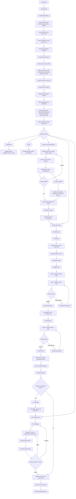

# Baltazar Studio Service Workflow Map

Editable source file for mapping the real Baltazar Studio workflow before turning it into Canva, Miro, or dashboard UI.

## Purpose

Create a client-facing service workflow map that shows the full journey from first interest to guided preparation, delivery, handoff, and continued support.

This file should stay practical and editable. If something does not match the current system, revise the source here first before updating any visual artifact.

SEO report presentation keeps page decisions in a stable vertical register: Page, Finding and next step, and Action align as desktop columns, then collapse into a page/action header with the explanation below on mobile. Recommendation workstreams use recognizable icons in matching circular holders.

Related planning docs:

- `BALTZ_CLIENT_CHAT_PREVIEW_MVP.md` for the In Full Flight client chat-to-edit product model and stack.

## Canonical Service Process Contract

The executable source of truth for dashboard service processes is `src/portal/processDefinitions.ts`. Playbook prose explains how a service is delivered, while the canonical process contract defines the stable data the product uses to render and govern it.

Every process definition must include:

- A stable process ID and version.
- The owning service and process category.
- Ordered stages with a stable ID, client-safe label, icon, kind, owner, and access level.
- Required inputs, produced outputs, and the explicit next action for every stage.
- Blocking approval gates and their approvers where progress requires a decision.
- The final output and an optional typed handoff target.
- A client presentation when several internal stages are intentionally grouped into a simpler client-facing skeleton.

The initial registry covers Brand Checkup, Website Checkup, SEO Checkup, Funnel Lab, Website Lab, Social Media Operations, and SEO Planning & Execution. Existing Brand, Website, Funnel, and Website Build stage rails now read their IDs and labels from this contract. SEO retains its five-stage internal process and explicitly defines the three-stage client presentation instead of treating them as competing processes.

Service playbooks reference the corresponding process ID. New custom playbooks remain unbound until they are deliberately attached to a governed process definition; a Markdown document alone does not create executable workflow behavior.

### Template And Client Run Boundary

A process template and a client process run are different records:

- The template is the reusable, editable definition in `src/portal/processDefinitions.ts`.
- A client run stores the process ID, template version, and an immutable snapshot of the template stages that existed when that run began.
- Run state stores the client, current stage, per-stage status, approval-waiting state, timestamps, completion state, and the frozen template snapshot.
- Editing a template affects only future runs. Existing runs continue against their saved snapshot until an explicit migration is designed and recorded.
- Older workspace records without a process run remain readable and receive a versioned snapshot the next time that workflow is saved.

Guided Brand, Website, Funnel, and Website Build sessions persist their process run with the guided session. SEO and Social persist the run beside their existing engine-work payload. Funnel plan records also retain the originating run snapshot so a delivered plan remains traceable to the process version that produced it.

### Shared Process Tracker

Snapshot reads all visible client process runs through one role-aware selector. The tracker shows the current stage, run status, completed-stage progress, next owner, next action, approval blocker, and due state from the same process-run contract used by the engines.

- Admin sees process runs for all visible clients.
- Manager sees only clients available to that role.
- Client sees only their workspace and receives client-safe wording for internal stages.
- An internal stage is summarized as `Studio review` for clients until a client-visible output or approval is ready.
- Approval-waiting runs name the required approver as the blocker.
- Tracker cards deep-link to the relevant Checkup or Lab workspace.
- Legacy Brand, Website, SEO, Social, and Funnel records are represented through a deterministic compatibility adapter until their next save persists the full process run.

### Shared Stage Transition Guard

All process runs now use one deterministic transition evaluator before a requested stage is persisted. A run can remain on its current stage or move forward only when every earlier stage in its saved template snapshot is complete. Blocking approval gates use the saved gate label as the reason; an unknown stage is rejected instead of being silently accepted.

This guard is intentionally local and non-automated. It does not approve work, infer that a requirement was met, send a notification, or advance a client automatically. Existing engines continue to decide when their real work is complete, then pass those explicit completed stage IDs into the shared run contract. Legacy records receive the same ordered-stage interpretation through their compatibility adapter.

### Persisted Process Handoffs

Completed Brand and Website Checkups now create a durable typed handoff when a user explicitly continues to Website Lab. The handoff records the source process and run, frozen template and output versions, target process, final-output label, approved scope, included recommendations, unresolved evidence, approval state, sender, receiver, timestamps, tasks created from the handoff, and a sanitized copy of client-supplied string or list context. Generated internal reasoning and arbitrary objects are not carried forward.

Website Lab consumes the latest ready handoff for that client, marks it accepted, uses its client-safe context as a prefill, and stores the handoff ID on the target process run. Its handoff summary shows the approved transfer and traceability counts, while imported implementation To-do's are linked back to the originating handoff record. Browser-local keys remain only as a one-time navigation hint and legacy fallback. Restarting the source Checkup removes its saved handoffs so stale audit context cannot silently reopen a build.

On the first approved handoff acceptance, Website Lab also creates a client-independent implementation workspace from that exact handoff. Approved scope becomes bounded preparation work, included recommendations become build work, and the fixed operating sequence is Scope & content preparation, Design-system approval, Page design & build, Content population & QA, and Launch & measurement. Design Preview, Full Site Preview, and Handoff Package remain explicit client-owned approval gates. Stable handoff-derived source IDs make the seed idempotent and keep every generated task traceable to the source output version.

Each versioned process run also retains an append-only event history for creation, stage changes, approval waits, completion, and accepted-handoff linkage. The event history is derived only from persisted semantic changes, so repeated saves at the same stage do not create noise. It establishes traceability for later Activity and notification work without enabling automatic approvals, publishing, or messaging.

Handoff creation is explicit and non-automated: completing a Checkup does not start a paid Lab, create tasks, change access, or imply commercial approval.

### Standard AI Review Lifecycle

Every AI-assisted output uses one review lifecycle: `Not generated → Draft → Needs review → Approved → Shared`. The shared contract is persisted with guided Checkup and Lab sessions, and older records derive the same state from their existing generated result, approval, and sharing facts. Funnel index cards, Social Media planning, generated-stage headers, and Approvals use the same labels instead of local variants such as Ready for approval, Ready to ship, Scheduled, or Complete.

The transition order is deterministic. A human may return `Needs review` to `Draft` when requesting changes, but AI cannot independently mark an output Approved or Shared. Approval still requires the existing explicit review action; Shared is recorded only after the existing share action succeeds. The lifecycle does not alter scope, complete a process gate, publish content, or send a notification by itself.

### Client Capability Access

The shared portal skeleton does not imply equal operational access. Every role reads one capability profile, while every engine stage also respects the owner, access level, and approval gate in its canonical process definition.

- **Standard client** (default/Cocoon): sees Snapshot process tracking, Approvals, the Brand, Website, and SEO Checkup skeleton, client-owned intake, and approved client-visible outputs. Studio evidence, unapproved drafts, reset controls, task imports, proposal publishing, and Labs remain unavailable.
- **Collaborative client** (`wiaw`): receives the standard client capabilities plus selected live Lab stages that require client participation. Studio-owned evidence and publishing controls remain internal.
- **In Full Flight client** (`iff`): receives the collaborative engine access needed for active retained services, still bounded by each stage's owner, access level, and approval state.
- **Admin and Manager**: can operate live Checkups and Labs, inspect evidence, review drafts, approve studio work, create task imports, and publish client outputs within their existing role permissions.

Direct URLs use the same capability checks as navigation. A hidden link therefore cannot bypass an entitlement. Access tier is derived from the client's confirmed service record; a completed audit or handoff never upgrades access automatically.

## Current Website Development Process Snapshot

Use this section as the plain-English view of where the website-development journey is now and what stages come next.

### Stage 1: Lead Capture

Status: external surface, not implemented in this dashboard repo.

The client enters the first layer of information on the landing page:

- Name
- Email
- Phone number
- Business name
- Website

This landing page lives outside this repository and is previewed separately on `localhost:3411`. For now, the dashboard should represent this with dummy/mock lead data only.

Next stage: the studio sends the Cocoon Consult link.

### Stage 2: Cocoon Consult Intake

Status: represented in the dashboard as the Cocoon Consult workspace.

The client completes the deeper Cocoon Consult form. This is where the studio gathers business context, website context, goals, blockers, assets, access notes, and readiness signals.

Next stage: the intake becomes an audit draft.

### Stage 3: Audit Review

Status: partially represented in the dashboard with generated audit preview behavior.

The website is reviewed against the Cocoon audit checklist:

- Content
- Design & Typography
- Navigation & Structure
- Accessibility & Compliance
- Mobile Responsiveness
- Search Engine Optimization

The ideal review path is:

1. Intake and website review.
2. First AI review pass.
3. Second AI review pass.
4. Human review.
5. Client-safe audit results.

Next stage: the client sees audit results and is invited into the paid guided Cocoon Consult.

### Stage 4: Paid Cocoon Consult

Status: represented as Cocoon Consult Premium / paid Cocoon in the dashboard.

The client pays for the guided audit call. Payment is manual through Wise, using a payment email with QR/payment details.

Payment unlocks:

- Booking link for the guided Cocoon call
- Three-month dashboard access
- 24-hour studio guidance window around the audit walkthrough
- Strategy translation into a workflow, dashboard path, booking link, or funnel structure

Next stage: the guided Cocoon call turns the audit into a build-ready strategy.

### Stage 5: Strategy Handoff

Status: planned workflow stage; dashboard copy and states are being aligned.

After the guided call, the studio turns the audit into a practical plan. Depending on what the client needs, this can become:

- Workflow map
- Dashboard path
- Custom booking link
- Full funnel structure
- Website build plan

Next stage: if implementation is needed, the studio recommends Winged In A Week.

### Stage 6: Winged In A Week

Status: represented in the dashboard with WIAW milestones, phases, tasks, files, gates, and approvals.

WIAW is the build and implementation stage. The client should only reach this after Cocoon Consult has identified the right strategy.

The build path is:

1. Project starts.
2. Foundation: access, assets, audit notes, and setup.
3. Strategy, sitemap, and copy.
4. Design and build.
5. Gate 1: design preview and client decision.
6. Build pages, CMS, preview links, QA, and polish.
7. Gate 2: full-site preview and client decision.
8. Launch prep: DNS, SSL, analytics, and production launch.
9. Gate 3: handoff package.
10. Project complete.

Next stage: the client either continues into In Full Flight or receives a follow-up nurture path.

The Website Builder starts by reading the selected client's saved workspace notes, then combines them with the best available source: an existing website, an uploaded brief or copy document, pasted planning notes, or a combination. The client then confirms the exact pages to design. That confirmed list becomes the final sitemap and the only automatic page-design scope; a discovered current sitemap is reference material for content reuse, SEO preservation, migration, redirects, and retirement. The builder produces one concise purpose, key-message, primary-action, and copy-source brief per scoped page before creating the implementation task plan. Confirmed intake answers win when a note conflicts, and unsupported claims remain flagged for approval.

The Funnel Builder follows the same client-notes-first rule before it processes conversion copy. Its wireframe offers five actual layout directions — Conversion Stack, Split Hero, Editorial Story, Modular Bento, and Immersive Visual — across a complete page skeleton: navigation, hero, trust proof, problem and stakes, benefits, audience fit, solution or features, process, proof, offer, relevant integrations, pricing or value, FAQ, final call to action, and footer or legal needs. Sections that do not apply to the selected funnel remain explicitly conditional instead of silently disappearing.

The final Funnel Development Plan keeps its editable task checklist inside the document immediately below Preview, Copy, and Share. Selected tasks can still be renamed, prioritized, exported as CSV, or imported into To-do's. Preview generates a real A4 PDF and displays that PDF in the built-in viewer before download or printing. Share first persists the client-safe result into Approvals, then opens a popup with a direct client review link and an explicit copy action.

### Client Engine Access And Approvals

Audits and Builders are studio execution tools by default. Standard client workspaces do not expose those engines, their drafts, or their internal generation steps. When the studio finishes an audit report or builder output, it deliberately shares that final result into the matching client's Approvals area. Approvals is therefore the single client-facing review surface for standard engagements.

In Full Flight is the exception because it is an active partnership workspace. Clients whose current service is In Full Flight can open and use Audits and Builders directly in addition to reviewing shared final outputs. This access follows the active project service, not a manually assigned UI role, so it closes when the partnership is no longer active.

### Stage 7: In Full Flight

Status: active for retained Social Media and SEO planning, with the broader post-launch support layer continuing to expand.

In Full Flight is the ongoing support and hypercare stage after WIAW. It can include maintenance, content updates, social media support, optimization, reporting, experiments, and continued execution.

Next stage: continue, adjust, pause, or eventually end dashboard access.

### Service Playbooks As The Execution Source Of Truth

The Playbooks area is the operating contract for the studio and its AI. Before executing a task, the assigned person or AI should open the playbook that matches the service and function, preserve its prerequisites and approved inputs, and produce the enumerated outputs. If the live feature set changes, update the playbook in the same implementation turn so the product and operating method cannot drift.

| Service | Required operating playbooks | Boundary |
| --- | --- | --- |
| Cocoon Consult | Brand Audit, Website Audit, SEO Audit | Own discovery, evidence, findings, approvals, and the builder handoff. |
| Winged In A Week | Funnel Build, Website Build | Own fixed-scope implementation planning, approval gates, tasks, launch, and handoff. |
| In Full Flight | Social Media Operations, SEO Planning And Execution | Own recurring monthly content delivery and crawl-led 90-day SEO growth cycles. |

Execution rules:

- Keep one playbook per sold service function. Shared steps such as intake, consultation, proposals, approval gates, chat requests, upkeep, escalation, handoff, and offboarding belong inside the relevant service manual instead of becoming separate library cards.
- Every playbook follows the same delivery boundary: standard clients provide source material through their workspace and receive only studio-shared final outputs in Approvals; active In Full Flight partners may collaborate directly inside the relevant engine.
- AI generation stays server-side with service-specific credentials, recorded sources, explicit assumptions, studio review, and no provider keys or internal prompts exposed in client records or exports.
- Every audit lives under Cocoon Consult, even when its findings later power a builder.
- SEO Audit owns the crawl evidence and prioritized findings; In Full Flight SEO owns keywords, page mapping, metadata, proposed information architecture, and the execution roadmap.
- Winged In A Week owns Funnel Build and Website Build. Both must start from approved Cocoon strategy or audit context.
- In Full Flight Social Media keeps each client month isolated and carries the approved source, voice, pillars, channels, cadence, cross-posting, posts, approvals, and schedule through one recurring record.
- The detailed playbook must enumerate every supported input, stage, control, decision, output, handoff, and fail-safe that the dashboard exposes.
- Every playbook must also enumerate the live questionnaire or source fields, every assessed or produced area, the exact scoring or readiness formula, missing-evidence treatment, and the path from raw submission through normalization, generation or analysis, human review, persistence, approval, and handoff.
- A displayed score must come from recorded evidence and a published deterministic formula. Empty, failed, or incomplete analyses remain Pending or Provisional; client names, seeded records, self-assessment defaults, and AI prose must never synthesize a score.
- Services without an evidence-valid quality formula use explicit completeness and approval gates instead of a cosmetic percentage. Reported performance always comes from a named measurement source.
- AI must not silently invent missing client facts, change an approved strategy, merge client records, or bypass a prerequisite. It should name the missing input or assumption and stop when it would materially change the sold scope.

### Baselines, Targeted Rechecks, And Escalation

Creating a client account should enqueue one durable evidence-baseline workflow after the real domain and required sources are saved. The baseline is immutable comparison evidence, not a final answer that is copied forever and not a reason to repeat the entire Checkup on every visit.

Each deterministic check stores its own status, evidence dependencies, evidence fingerprint, captured-at time, checklist version, and last verified result. Routine follow-up work selects only:

- Checks whose current status is Failed or Unverified.
- Checks whose supporting evidence is missing, stale, or changed.
- Previously passed checks that depend on a source flagged by a lightweight change detector.
- New or materially changed checks introduced by a published Playbook/checklist version.

A cheap sentinel pass may inspect the domain, sitemap, robots rules, response health, source fingerprints, connected-data freshness, and known integration availability without generating another full report. It expands the target set only when it detects a relevant change. A full evidence refresh is reserved for a domain/source replacement, a material site-structure change, a major checklist version, evidence beyond the approved freshness window, a significant regression or anomaly, an explicit studio request, or a recovery policy that requires it.

Targeted rechecks create a new immutable check-result revision and update the current Checkup projection; they do not overwrite the original baseline or duplicate unchanged evidence. If a failed or unverified check becomes Passed, the record retains the previous result, new evidence, verifying agent or person, and timestamp. If a passed check regresses, the system opens a blocker or review item with an owner and recovery action instead of silently lowering the score.

Labs consume the latest approved Checkup projection plus its versioned handoff. They do not trigger a full Checkup automatically. A Lab may request a targeted recheck when an implementation decision depends on missing, stale, failed, or contradictory evidence.

### Reusable Service Agents And Durable Memory

The background workflow runner and the service agent have separate responsibilities:

- The workflow runner owns scheduling, idempotency, retries, checkpoints, timeouts, concurrency, cancellation, and resumability.
- The service agent reads a published agent definition, selects allowed tools, interprets qualitative evidence, prepares structured findings, and stops at approval or policy boundaries.
- Deterministic tools own crawling, DOM checks, Lighthouse, source hashing, validation, persistence, blocker creation, and handoff creation. The model must not fabricate their results.

Start with one governed service agent rather than a free-form swarm. The agent definition binds a stable agent ID and version to a published Playbook version, instructions, allowed tools, structured output schema, approval requirements, memory policy, owner, change summary, and eval suite. Brand, Website, SEO, Funnel, and retained-service behavior can begin as versioned configurations of that agent. Add specialist handoffs only when a measured workflow needs separate ownership or context.

“Tell the agent once and it remembers” is implemented through four explicit state layers:

1. **Instructions:** versioned agent and Playbook rules that change only through an explicit draft, review, and publish action.
2. **Client memory:** approved facts, preferences, decisions, terminology, source references, scope, provenance, reviewer, confidence, and optional expiry stored in the dashboard database.
3. **Run memory:** the current target checks, evidence snapshot IDs, tool outputs, blockers, approvals, and resumable workflow state.
4. **Learning history:** concise run outcomes, corrections, eval failures, and accepted improvements used to propose a new agent version; it never edits published instructions automatically.

Conversation history is useful for continuing one interaction but is not the business source of truth. The agent retrieves only memory scoped to the current client, service, and stage. Generated prose, inferred facts, rejected recommendations, cross-client data, secrets, and internal reasoning are never promoted to durable client memory. A user or trusted deterministic integration must verify a fact before it becomes reusable memory.

The first tool contract should stay narrow and auditable:

- `get_recheck_targets(clientId, serviceId)` returns Failed, Unverified, stale, changed, and newly required checks with reasons.
- `collect_evidence(targetIds)` gathers only the dependencies required by those targets.
- `evaluate_deterministic_checks(targetIds, evidenceSnapshotId)` runs published formulas without model judgment.
- `classify_qualitative_evidence(targetIds, evidenceSnapshotId)` returns structured, cited assessments for the checks that genuinely require AI.
- `record_check_revision(...)` appends evidence-backed results without overwriting the baseline.
- `open_process_exception(...)` records an owner, recovery action, and retry policy.
- `request_human_review(...)` pauses at claims, scope, approval, or client-facing publication boundaries.
- `create_approved_handoff(...)` transfers only reviewed outputs into the relevant Lab.

Every run records the agent version, Playbook/checklist version, selected targets and reasons, evidence IDs, tools called, output schema version, approvals, corrections, cost/latency, and final state. Replaying the same idempotency key must return the existing run rather than duplicate evidence or actions.

### End-To-End Evidence And Agent Workflow

The operating sequence for Checkups and Labs is:

1. **Create the client:** save the real client and normalized source record first.
2. **Commit the trigger:** emit one idempotent `client.created` baseline event after the database write succeeds.
3. **Start the durable workflow:** create a resumable run with the client, service, source version, Playbook/checklist version, and agent version frozen.
4. **Choose the scope:** a baseline targets every applicable check; a routine run targets only Failed, Unverified, stale, changed, newly required, or sentinel-affected checks.
5. **Collect required evidence:** discover and capture only the pages, assets, connected data, and device variants required by the selected targets.
6. **Run deterministic checks:** compute factual statuses and formulas before invoking AI.
7. **Run qualitative analysis:** the service agent evaluates only the selected qualitative checks using stored evidence and approved scoped memory.
8. **Validate the result:** enforce provenance, coverage, confidence, contradiction, and policy gates; unsupported work remains Unverified.
9. **Persist revisions:** append evidence and check-result revisions, retain the immutable baseline, and update the current Checkup projection atomically.
10. **Handle exceptions:** partial, blocked, failed, cancelled, and regressed results receive an owner, recovery action, retry policy, and durable checkpoint.
11. **Review and approve:** human review remains mandatory wherever the published Agent Definition or Playbook requires it.
12. **Share or hand off:** approved client-safe Checkup output may be shared through Approvals or transferred as a versioned handoff into the relevant Lab.
13. **Monitor cheaply:** scheduled or manual sentinel checks look for material source/dependency changes without producing another report.
14. **Escalate deliberately:** a sentinel flag expands the affected target set; only an approved full-refresh trigger restarts the complete evidence scope.
15. **Learn safely:** corrections and eval failures create a Learning Event and proposed Agent Definition draft; published instructions and durable Client Memory never self-modify.

The visible run status follows the durable workflow rather than an invented percentage:

`Queued → Validating → Discovering → Capturing → Checking → Reviewing → Ready`

`Partial`, `Blocked`, `Failed`, and `Cancelled` are terminal or resumable operational states with explicit recovery information. A no-change targeted run ends as `Current` without creating a duplicate report.

Data ownership remains unambiguous:

| Layer | Source of truth | May update it |
| --- | --- | --- |
| Published operating method | Versioned Playbook and Agent Definition | Explicit internal draft/review/publish action |
| Client facts and preferences | Approved scoped Client Memory | Human or trusted deterministic integration |
| Website and connected-data facts | Immutable Evidence Snapshot and items | Evidence workflow tools |
| Check status | Append-only Check Result Revision | Deterministic evaluator or reviewed qualitative agent result |
| Current Checkup | Projection of applicable latest verified revisions | Atomic projection service |
| Current Lab context | Approved versioned Checkup handoff plus Lab inputs | Explicit handoff and Lab workflow |
| One active run | Run Memory, events, checkpoints, and approvals | Durable workflow runner and approved tools |
| Proposed process improvement | Learning Event and draft Agent Definition | Eval/correction pipeline followed by human review |

### Implementation And Rollout Workflow

Work proceeds in eight gated releases rather than one large switch:

1. **Data foundation:** establish tenant-safe records for clients, sources, evidence, check revisions, service runs, Agent Definitions, scoped memory, and learning events.
2. **Durable execution:** move crawl, render, Lighthouse, persistence, and recovery into resumable background steps with bounded concurrency and idempotent events.
3. **Authoritative baseline:** prove that a new arbitrary domain can produce a cited baseline without demo fallbacks or unsupported scoring.
4. **Selective maintenance:** add sentinel detection, dependency expansion, targeted rechecks, regression blockers, and true no-op runs.
5. **Reusable agent:** bind one published Agent Definition to narrow tools, structured outputs, approved scoped memory, resumable approvals, and reviewable learning.
6. **Adaptive UI:** expose real workflow stage, target count, elapsed time, estimated completion range, evidence freshness, approvals, and concise recovery actions without stretching sparse content.
7. **Migration:** preserve valid history and deep links while tagging demos, removing implicit seeds, and retiring synchronous evidence recollection.
8. **Pilot and release:** run evals, security and observability checks, shadow comparisons, one real-client pilot, controlled cohorts, and a data-preserving rollback rehearsal.

Every release has an acceptance gate. Code-complete work remains provisional until its data, browser, restart, isolation, or parity proof passes. The durable runner now includes committed-event dispatch, source validation, reasoned page discovery, evidence persistence, deterministic checklist analysis, immutable result revisions, progress events, cancellation, bounded capture, partial evidence, stale-run blocking, and recovery redispatch. Dependency-aware sentinels, true no-op targeted rechecks, regression blockers, Lab dependency requests, a governed qualitative agent, and Admin/Manager human correction are implemented. The Trisha Baltazar pilot has now proved arbitrary-domain capture, exact targeted selection, scoped approved memory, client isolation, human review gates, and partial-run recovery from saved evidence. The remaining release gates are a genuine reviewed legacy-to-normalized shadow comparison and a controlled production cohort before general release.

### Stage 8: Nurture And Access End

Status: mapped as a system lifecycle rule, not a visible client dashboard tab.

If the client does not continue after Cocoon or WIAW, they enter the appropriate nurture email path. If no action happens after the access window, dashboard access is deleted. A future restart should require a new paid Cocoon Consult because the old audit may be stale.

### Current Dashboard Implementation Focus

The dashboard is currently a mock-data preview of this workflow. The most important next implementation stages are:

1. Finish explicit lifecycle, payment, access-window, guidance-window, audit, and AI-review state modeling.
2. Keep landing-page data mocked until the external landing page is ready to integrate.
3. Make the dashboard clearly distinguish three-month Cocoon dashboard access from the 24-hour guidance window.
4. Keep Wise payment details admin-reviewed before anything client-facing is shown.
5. Keep WIAW as the implementation stage after Cocoon, not as a separate menu the client casually chooses.
6. Keep internal Admin and Superadmin operations out of the client-facing journey.

## Assignees And Dynamic Notifications

Use this section to define who owns each task and what notification should be sent when the task is completed. Notifications should be generated from the completed task type, assignee, client stage, and next required action. They should not be static placeholder messages.

### Assignee Rules

| Assignee | Owns | Client Can See? | Notes |
| --- | --- | --- | --- |
| Client | Intake answers, asset uploads, access sharing, approvals, revision notes, booking decisions | Yes | Client tasks should be written as clear actions, not internal production language. |
| Studio Admin | Audit review, strategy planning, design/build work, QA, revision handling, Wise payment review, launch prep | Sometimes | Client can see outcomes and requests, but not internal notes or private task details. |
| Superadmin | Templates, permissions, lifecycle setup, dashboard deletion, plan rules, system oversight | No | Superadmin work is internal only. |
| AI / System | Draft audit findings, summarize notes, classify task status, prepare notifications, queue emails, update timers | No, unless approved | AI outputs need studio review before client-facing claims, payment details, or scope promises are sent. |
| Client + Studio Admin | Approval gates, guided call prep, launch readiness, handoff confirmation | Yes | Shared tasks should clearly show which side needs to act next. |

### Completion Notification Matrix

| Completed Task | Assigned To | Notification Recipient | Notification Message Should Say | Next Action |
| --- | --- | --- | --- | --- |
| Landing page signup received | Client / System | Studio Admin | New lead submitted basic details and is ready for Cocoon Consult link review. | Send Cocoon Consult link. |
| Cocoon Consult link sent | Studio Admin / System | Client | Cocoon Consult is ready; complete the deeper intake when ready. | Client starts the consult form. |
| Cocoon intake started | Client | Studio Admin | Client started the Cocoon Consult intake but has not completed it yet. | Monitor progress or send reminder if inactive. |
| Cocoon intake completed | Client | Studio Admin | Client completed the intake; audit review can begin. | Run audit review passes. |
| First AI audit pass completed | AI / System | Studio Admin | First audit draft is ready for comparison and review. | Run second review pass or inspect findings. |
| Second AI audit pass completed | AI / System | Studio Admin | Cross-check audit pass is complete; conflicts and weak findings need human review. | Human reviews final audit. |
| Human audit review completed | Studio Admin | Client | Audit results are ready to review inside the dashboard. | Client reviews results and guided Cocoon offer. |
| Wise payment email prepared | Studio Admin / AI | Studio Admin | Wise payment details are drafted and need approval before sending. | Approve and send payment email. |
| Wise payment email sent | Studio Admin / System | Client | Payment instructions were sent; Cocoon booking unlocks after confirmation. | Client pays through Wise. |
| Wise payment confirmed | Studio Admin / System | Client | Payment confirmed; booking, three-month dashboard access, and 24-hour guidance window are unlocked. | Client books guided Cocoon call. |
| Guided Cocoon call booked | Client | Studio Admin | Client booked the guided Cocoon call. | Prepare call brief. |
| Guided Cocoon call completed | Studio Admin | Client | Strategy handoff is ready or in progress based on the guided audit. | Review handoff and WIAW recommendation. |
| WIAW recommended | Studio Admin | Client | Based on the audit, the next recommended step is Winged In A Week. | Client confirms whether to move forward. |
| WIAW confirmed | Client / Studio Admin | Client + Studio Admin | WIAW workspace is active and implementation can begin. | Start Foundation tasks. |
| Client asset upload completed | Client | Studio Admin | Client uploaded requested files or access details. | Review assets and continue build prep. |
| Studio foundation task completed | Studio Admin | Client | A foundation item is complete; the project is moving toward design/build. | Continue next foundation task or unlock next phase. |
| Design preview sent | Studio Admin | Client | Design preview is ready for review. | Client approves or leaves revision notes. |
| Client approval completed | Client | Studio Admin | Client approved the current gate. | Move to the next build stage. |
| Client revision notes submitted | Client | Studio Admin | Client submitted notes that need review and task triage. | Categorize notes and revise. |
| Build QA completed | Studio Admin | Client | Full-site preview is ready for review. | Client reviews Gate 2. |
| Launch prep completed | Studio Admin | Client | Launch prep is complete and the site is ready for final handoff. | Send handoff package. |
| Handoff package sent | Studio Admin | Client | Handoff package is ready; project is complete unless continued support is selected. | Decide on In Full Flight. |
| In Full Flight task completed | Studio Admin | Client | A support or optimization request was completed. | Client reviews result or adds next request. |
| No-action nurture step sent | System | Client | Helpful follow-up was sent because the client has not continued yet. | Client continues, pauses, or lets access expire. |
| Dashboard access window ended | System / Superadmin | Studio Admin | Client access window ended; dashboard deletion or archive review is due. | Delete access or manually extend. |

### Current Dashboard Notification Triggers

The current dashboard does not yet run a background automation engine. The shared portal shell derives role-scoped update events at render time in `src/portal/selectors.ts`; the older project notification surface continues to derive its rows from selected project state in `src/components/notifications.tsx`.

Current trigger sources:

| Source In Project Data | Trigger Condition | Admin Receives | Client Receives | Destination / Action |
| --- | --- | --- | --- | --- |
| `project.workflow.notifications` | Lifecycle event exists in the workflow data. | All workflow notifications. | Only records marked `clientVisible`. | Open the related dashboard area implied by the event type. |
| Approval gate | Gate status is `sent`. | Studio sent a gate for review, with approve/deny actions where allowed. | Review request from Baltazar Studio. | Reviews/Tasks for gate decision. |
| Approval gate | Gate status is `revision`. | Client requested revisions. | Not currently pushed to the client list. | Admin review queue. |
| Approval gate | Gate status is `approved`. | Client approved the gate. | Approval received confirmation. | Next milestone/phase context. |
| Phase tasks | All tasks in a phase are complete. | Phase completed by Studio. | Milestone/phase completed by Baltazar Studio. | Milestones or current project overview. |
| Portal task | Status is `review`. | Task and client are named as ready for review. | Not shown. | Open To-do's. |
| Portal task owned by Client | Status changes to `done`. | Client, task, and completion are named. | The completed request is removed from the client's action list. | Open To-do's. |
| Portal task owned by Studio / Assistant / Milestone | Status is `done`. | Not repeated back to the completing studio role. | The completed task is named as an update. | Open To-do's. |
| Portal task | A completed task is reopened or corrected. | The derived completion event disappears or changes with the current status. | The stale completion event disappears; an active client-owned task returns to the action list. | Open To-do's. |

Current read/dismiss behavior:

- Read and dismissed states are local UI state in the current session.
- Notification badge counts are derived from unread notifications that have not been dismissed.
- Popover and full Notifications page share the same row renderer.
- Notification and activity timestamps use the same display rule: `Now`, minutes, hours, then month/day only after 24 hours.
- The notification list is not yet stored as a normalized notification table in Supabase.
- The shared shell digest is intentionally derived from current persisted workspace state. It is bounded to five visible rows, keeps the full count, and deep-links each row to its current destination.
- This render-time reconciliation does not send a message, advance a workflow, approve work, or enable background notification automation.

### Notification Push Decision Rules

Use these rules when deciding whether a task completion should create or update a notification:

1. Push a notification only when the event changes what someone needs to do, review, approve, book, upload, pay, or know.
2. Do not push noise for internal micro-tasks unless they unblock a client-visible step or an admin decision.
3. A notification needs a recipient, trigger event, actor, target, destination, and next action before it is valid.
4. If the client must act, the first sentence should name the client action.
5. If the studio must act, the message should name the admin queue or workflow step.
6. If a task is reopened, replaced, or corrected, update or resolve the old notification instead of leaving a stale alert.
7. Billing, AI review automation, notification automation, and dashboard deletion automation remain documented only until those business rules are approved.

### Dynamic Notification Requirements

- Notification copy should include the completed task name, client/project name, current stage, and the next required action.
- Notification recipients should come from the task assignee and affected role, not from one global notification list.
- Client notifications should only show client-safe outcomes, requests, deadlines, approvals, and next steps.
- Admin notifications should include operational context, review needs, blockers, and routing details.
- Superadmin notifications should only appear for system, access, permission, template, or deletion events.
- AI-generated notifications should stay in draft/review state when they mention audit claims, payment details, project scope, launch instructions, or client-facing promises.
- Completing a task should update the related milestone, phase, access state, and notification badge count together.
- Reopening or changing a completed task should either update the original notification state or send a correction, not leave stale notifications visible.
- If a completed task unlocks another stage, the notification should name the unlocked stage.
- If a completed task requires client action, the notification should make the client action the first sentence.

Implementation note: tasks that legitimately advance a workflow carry an explicit, reversible `workflowEffects` link. The link declares the exact Journey gate, project stage/progress, deliverable state, dashboard access state, and next-action projection for both completion and reopening. Ordinary tasks have no workflow effects. All portal task status paths apply the task and its declared projections in one persisted workspace snapshot, while the notification digest derives its count from that same post-transition state.

## Current System Draft

The workflow currently appears to include three major surfaces:

- Landing Page (external repo, previewed separately on `localhost:3411`)
- Cocoon Consult Link / Audit Experience
- Wise / Manual Payment Email
- Dashboard

Implementation note: the landing page does not live in this repository. In this dashboard repo, landing-page signup data should be represented with dummy/mock data until the external `localhost:3411` landing page is ready to integrate.

The Dashboard has multiple role and client views:

- Superadmin
- Admin
- Cocoon Consult Workspace
- WIAW
- In Full Flight

Superadmin and Admin are internal views only. They should not appear in the client-facing map. They exist for the studio owner and website developers to assign, manage, and deliver projects without exposing private studio operations to clients.

Clients do not select from these views as optional plans. The intended journey is sequential:

1. Cocoon Consult
2. Winged In A Week
3. In Full Flight

Each stage should feel like the next natural layer of the work, not a menu of disconnected offers.

In Full Flight happens after WIAW as an additional hypercare and ongoing support layer. It is the extra upsell for clients who want the studio to continue helping after launch, such as website maintenance, social media support, content updates, optimization, or other ongoing execution. Even though it is an additional paid layer, it should still be presented as part of the full end-to-end client journey.

Every website build must pass through Cocoon Consult first. The landing page collects the basic lead details, then the studio sends the Cocoon Consult link. The consult experience lets the client complete the deeper audit form and see their results. The booking call and extended audit access are paid, because that is where the studio walks them through the findings, maps the workflow, and turns the audit into a build-ready strategy.

## Responsibility Layers

Use these layers when reviewing or visualizing the workflow:

| Layer | Owner | Color Direction | Notes |
| --- | --- | --- | --- |
| Client | Client | Soft Green | Reviews, approvals, uploads, decisions |
| Studio / Admin | Baltazar Studio | Soft Rose | Delivery work, QA, revisions, project management |
| Superadmin | Studio Leadership | Warm Gray | System oversight, templates, plans, permissions |
| Payment / System | Wise / Manual Payment Email | Beige | Wise payment email, QR code, payment confirmation, account creation, routing, records |
| Next Step / Upsell | Studio Recommendation | Muted Gold | Cocoon to WIAW transition, post-WIAW In Full Flight hypercare prompts |

## Full Internal Workflow Draft

This full source map includes internal Superadmin and Admin branches so the team can reason about the complete system. When creating a client-facing visual, remove the Superadmin and Admin branches and only show the client-safe journey.

```mermaid
flowchart TD
  A["Lead Enters"] --> B["Landing Page"]
  B --> B1["Landing Page Signup"]
  B1 --> B2["Collect Email, Phone, Name, Business Name, Website"]
  B2 --> C["Studio Sends Cocoon Consult Link"]
  C --> C0["Client Completes Cocoon Consult Form"]
  C0 --> C1["Cocoon Audit Results Generated"]
  C1 --> C2["Client Reviews Results"]
  C2 --> H["Paid Cocoon Consult Offer"]
  H --> H0["Book A Guided Audit Call And Receive Three-Month Dashboard Access"]
  H0 --> H1["Client Pays Cocoon Consult"]
  H1 --> I["Client Record Created"]
  I --> J["Dashboard Workspace Created"]
  J --> J1["Send Dashboard Login Credentials"]
  J1 --> J2["Unlock Booking Link, Three-Month Dashboard Access, And 24-Hour Guidance Window"]
  J2 --> H2["Client Schedules Guided Cocoon Call"]

  H2 --> K{"Workspace View"}

  K --> L["Superadmin"]
  K --> M["Admin"]
  K --> N["Cocoon Consult Workspace"]
  K --> O["WIAW Client View"]
  K --> P["In Full Flight View"]

  L --> L1["Manage System, Templates, Plans, Access"]
  M --> M1["Manage Selected Client And Delivery"]

  N --> N1["Collect Brand Prep, Scope, Assets, Access"]
  N1 --> N2["Review Cocoon Audit Results"]
  N2 --> N2A["Studio Walks Client Through Audit"]
  N2A --> N3{"Prep Complete?"}
  N3 -->|Not Yet| N1
  N3 -->|Yes| NS["Recommend Winged In A Week"]
  NS --> F["Winged In A Week"]

  F --> F1["Build Payment Or Confirmation"]
  F1 --> O

  O --> W1["Project Starts"]
  W1 --> W2["Foundation"]
  W2 --> W3["Collect Access, Assets, Audit Notes"]
  W3 --> W4["Strategy, Sitemap, Copy"]
  W4 --> W5["Design And Build"]

  W5 --> W6["Design Phase"]
  W6 --> W7["Studio Completes Design Tasks"]
  W7 --> G1["Gate 1: Design Preview Sent"]

  G1 --> D1{"Client Decision"}
  D1 -->|Approve| W8["Build Phase Starts"]
  D1 -->|Notes Needed| R1["Studio Revises Design"]
  R1 --> G1

  W8 --> W9["Build Pages, CMS, Preview Links"]
  W9 --> W10["QA And Polish"]
  W10 --> G2["Gate 2: Full Site Preview Sent"]

  G2 --> D2{"Client Decision"}
  D2 -->|Approve| W11["Launch Prep"]
  D2 -->|Notes Needed| R2["Studio Revises Build"]
  R2 --> G2

  W11 --> W12["DNS, SSL, Analytics, Production Launch"]
  W12 --> G3["Gate 3: Handoff Package"]
  G3 --> W13["Project Complete"]

  W13 --> Q{"Ready For Continued Support?"}
  Q -->|Yes| G["In Full Flight"]
  Q -->|No| AB["Abandonment Success Email Series"]
  AB --> AB1["Nurture For One Month"]
  AB1 --> R["Delete Dashboard Access"]

  G --> G4["In Full Flight Payment Or Confirmation"]
  G4 --> P

  P --> P1["Plan Priorities"]
  P1 --> P2["Requests, Content, Optimization, Experiments"]
  P2 --> P3["Studio Executes Work"]
  P3 --> P4["Client Reviews Results"]
  P4 --> P5{"Continue, Adjust, Or Pause"}
  P5 -->|Continue| P1
  P5 -->|Adjust| P2
  P5 -->|Pause| AB

  N2A --> U1["Cocoon Findings"]
  U1 --> U2["Workflow, Dashboard, Booking Link, Or Funnel Structure"]
  U2 --> NS
```

## Sequential Service Journey

| Stage | Client Experience | Studio / Admin Work | Next Step / Upsell Moment |
| --- | --- | --- | --- |
| Landing Page Signup | Enter email, phone number, name, business name, and website | Capture the lead and confirm they belong in the studio path | Send the Cocoon Consult link |
| Cocoon Consult Audit | Complete the deeper form and review the generated results | Review audit context, identify gaps, and prepare the guided call pathway | Offer the paid guided audit call, booking link, and timed studio access |
| Paid Cocoon Consult | Book a call, walk through the audit with the studio, and access the dashboard for three months | Translate findings into the workflow, dashboard, custom booking link, or full funnel structure | Recommend WIAW when the strategy needs implementation |
| Winged In A Week | Receive the planning strategy, book with the studio, and keep unlimited dashboard access while working with Baltazar Studio | Build or prepare the full funnel structure, dashboard workflow, booking flow, and delivery plan | Invite the client to hand off to another agency or continue with WIAW execution |
| In Full Flight | Receive post-launch support, maintenance, and growth help | Handle maintenance, content, social media, optimization, reporting, and ongoing execution | Keep support framed as continuity, not pressure |

## Payment And Email Lifecycle

The system should only charge the client for the specific amount owed at the payment step they are entering. Payment should not imply they have selected from all available services; it should simply confirm the next stage in the sequential journey.

The current billing model is manual through Wise. The landing page form is not the paid checkout. It collects the lead's email, phone number, name, business name, and website so the studio can send the Cocoon Consult link.

Inside Cocoon Consult, the client completes the deeper audit form and can see their results. The final step is the paid guided audit call. Payment unlocks:

1. The booking link for the guided Cocoon audit call.
2. Three-month dashboard access as part of the paid Cocoon Consult.
3. The start of the studio's strategy translation: workflow, dashboard path, custom booking link, or full funnel structure.
4. A 24-hour studio guidance window around the audit walkthrough, separate from the three-month dashboard access.

The client should not have unlimited access to the studio by default after Cocoon. The paid Cocoon Consult can include three months of dashboard access and a 24-hour guidance window so the studio can walk them through what the audit means and what should happen next. If they work with Baltazar Studio through WIAW, dashboard access becomes unlimited for that working relationship.

For payment, the studio can send a Wise payment email with the QR code and payment details. Payment confirmation then triggers the booking/dashboard access step.

### Current Configurable Service Policies

The dashboard records these choices per client instead of hiding them in copy or silently inferring dates:

- Paid Cocoon uses `Cocoon Consult` by default; staff can record a client-specific admin label without changing the public taxonomy.
- Wise payment confirmation defaults to manual-only. A future verified-match integration can be enabled explicitly, but confirmation still requires the verified recipient and transfer reference.
- The reviewed Wise email has an editable subject/body with `{client_name}` and `{transfer_reference}` tokens. QR delivery is explicitly `approved asset`, `approved secure link`, or `none`; client-safe copy is projected only after staff marks the details sent.
- The three-month Cocoon dashboard window defaults to payment confirmation and can instead start at booking, guided-call completion, or a manual date.
- Guided-call completion starts the separate 24-hour guidance window.
- Confirmed WIAW removes the fixed dashboard expiry. Paused projects either retain or suspend access according to the recorded policy; cancellation defaults to ending access immediately.
- In Full Flight Labs require a completed WIAW/approved continuation source plus an active care plan, unless staff explicitly selects manual access.
- White-label output audience is explicit: clients, partners, or both. The default is clients.

| Moment | What We Collect | What Happens Next |
| --- | --- | --- |
| Landing Page Signup Submitted | Email, phone number, name, business name, website | Studio sends the Cocoon Consult link |
| Cocoon Consult Form Completed | Website, brand, business, content, technical, and readiness context | Client sees audit results and is prompted to book the guided Cocoon call |
| Paid Cocoon Consult Confirmed | Wise payment confirmation and booking details | Studio unlocks the booking link, three-month dashboard access, 24-hour guidance window, and guided review path |
| Guided Cocoon Call Complete | Audit findings, business goals, blockers, and implementation needs | Studio prepares the workflow, dashboard path, custom booking link, or full funnel structure |
| Cocoon Complete, WIAW Not Started | Email and Cocoon findings | Client receives a findings-based nurture path while the three-month dashboard access is active |
| WIAW Confirmed | Email and build payment confirmation | Client moves into WIAW planning and dashboard delivery with unlimited dashboard access while working with Baltazar Studio |
| WIAW Complete, In Full Flight Not Started | Email and project outcome context | Client receives a post-launch hypercare nurture series for one month |
| No Action After Access Window | Existing client record | Dashboard access is deleted; a future restart requires a new paid Cocoon Consult because the old audit may be stale |

## System And AI Actions

This section tracks what the backend, dashboard logic, admin tools, and AI support should do behind the client journey. These actions should support the studio workflow without exposing internal operations to the client.

| Moment | System / AI Action | Human Review Needed? | Client-Facing Output |
| --- | --- | --- | --- |
| Landing Page Signup Submitted | Create or update the lead record, normalize contact details, check whether the website URL is valid, tag the lead source, and queue the Cocoon Consult link email | No, unless the record looks incomplete or duplicated | Cocoon Consult link email |
| Cocoon Consult Link Sent | Track link delivery, open status, and whether the client starts the consult form | No | Reminder email if they do not start |
| Cocoon Consult Form Started | Save partial progress, detect missing answers, and prepare smart follow-up prompts | No | Form progress and gentle reminder |
| Cocoon Consult Form Completed | Generate the audit draft from form answers, website URL, uploaded context, and known audit checks | Yes, before final client-facing claims are treated as official | Audit results inside Cocoon Consult |
| Audit Draft Generated | Summarize findings by theme, assign severity, write plain-language impact, and recommend actions | Yes | Client-safe audit summary |
| White-Labeled Audit Needed | Apply client or partner branding, remove internal notes, format the audit as a client-safe PDF/page, and prepare export/share links | Yes | White-labeled audit report |
| Paid Cocoon Consult Offered | Generate the Wise payment email, include QR code/payment details, connect the payment to the correct client record, and send booking instructions after confirmation | Yes, before sending payment details | Wise payment email with QR |
| Wise Payment Confirmed | Mark Cocoon as paid, unlock booking, start the 24-hour guidance window, and grant three-month dashboard access | No, unless payment matching is unclear | Booking link and dashboard access |
| Guided Cocoon Call Booked | Send calendar confirmation, reminders, prep checklist, and internal pre-call brief | No for reminders; yes for the internal brief if used in the call | Booking confirmation and prep reminders |
| Guided Cocoon Call Complete | Turn notes and audit findings into the workflow map, dashboard path, custom booking link plan, or full funnel structure | Yes | Cocoon strategy handoff |
| WIAW Recommended | Generate the recommended next step using the Cocoon findings, readiness score, blockers, and implementation scope | Yes | WIAW recommendation |
| WIAW Confirmed | Unlock the WIAW workspace, switch dashboard access to unlimited while working together, create milestones, and generate the first task list | Yes, before client sees scope/tasks | WIAW dashboard workspace |
| Approval Gate Ready | Package preview links, summarize what changed, generate approval questions, and send notification | Yes | Gate 1, Gate 2, or Gate 3 approval request |
| Client Notes Submitted | Categorize notes, detect conflicts, create admin tasks, and summarize revision priorities | Yes | Confirmation that notes were received |
| WIAW Complete | Generate launch handoff, access notes, maintenance recommendations, and In Full Flight prompt | Yes | Handoff package and support invitation |
| No Continuation After Cocoon Or WIAW | Start the appropriate nurture path, send useful follow-up, and automatically archive or delete dashboard access when the follow-up window ends | No | Nurture emails and deletion notice |

Client Lab access is fail-closed: an approved accepted-or-linked Cocoon handoff prepares the WIAW workspace for staff, but the Client cannot enter live Labs until `wiawState` is explicitly confirmed. A persisted `dashboardAccessState: deleted` closes the Client portal shell entirely; returning requires a new paid Cocoon Consult because prior evidence may be stale. Admin preview can inspect that closed state without reopening access.

### AI Action Guardrails

- AI can draft, summarize, classify, format, and queue actions.
- AI should not send final audit claims, invoices, payment details, scope promises, or launch instructions without studio review unless the system has an explicit approval setting for that action.
- AI should keep internal reasoning, admin notes, cost estimates, and task details out of client-facing views.
- AI should always convert audit data into client-safe language: finding, impact, recommended action, and next step.
- White-labeled outputs must remove Baltazar Studio internal notes unless the client-facing brand is still Baltazar Studio.
- Payment automation should reference Wise and QR/payment details, not Stripe checkout language.
- Notifications should be helpful and specific, not pressure-based.

### Backend Automation Candidates

- Lead creation and deduplication.
- Cocoon Consult link delivery.
- Form progress saves and reminders.
- Audit draft generation.
- White-labeled report generation.
- Wise payment email generation with QR/payment details.
- Payment confirmation tracking.
- Booking link unlock.
- 24-hour guidance window timer.
- Three-month Cocoon dashboard access timer.
- Unlimited WIAW dashboard access while working together.
- Dashboard workspace creation.
- Role-based access control for Superadmin, Admin, client, and assigned developers.
- Notification routing by client stage.
- Approval gate packaging.
- Nurture email sequencing.
- Dashboard deletion scheduling after the no-action window.

### Cocoon To WIAW Nurture

- Triggered when Cocoon is complete but the client has not continued into WIAW.
- Uses the Cocoon audit findings to explain why the website build is the next natural step.
- Should feel like helpful follow-up, not pressure.
- Ends when the client confirms WIAW or when the three-month Cocoon dashboard access ends with no action. If the client returns later, they must pay for a new Cocoon Consult because the old audit may no longer be effective.

## Required Audit Before Build

Every website must be audited before the studio builds it. This is the reason the journey is sequential: clients cannot skip Cocoon Consult and jump directly into WIAW.

The audit should happen before build planning so the studio can identify:

- Current website issues
- Brand and content readiness
- Missing assets or access
- Technical setup concerns
- UX, SEO, accessibility, and performance gaps
- Launch blockers
- Whether WIAW is the right next step

The audit turns Cocoon into the strategic foundation for WIAW. It also gives the studio a client-safe reason to recommend the next stage without making the recommendation feel random or sales-led.

### Evidence-Based SEO Audit Checklist

SEO audits include a 27-item evidence checklist inside Audit findings. It evaluates the website itself rather than implementation access or CMS administration. The checklist is grouped into:

- Crawlability & indexation
- On-page content signals
- Architecture & internal linking
- Technical experience
- AIO, GEO & measurement

The collapsed checklist reveals these as five labeled category panels. Each check uses two content lines only: the check title first, followed by its crawl evidence or concise review description. Status remains in a separate trailing indicator so it does not interrupt the explanation.

Website Audit and SEO Audit share one guided loading treatment. For SEO, it appears while a crawler CSV or live sitemap is being analyzed, and it visibly connects inventory normalization, technical checks, page decisions, AIO/GEO evidence, and the client-facing report before the findings appear.

Every checklist item must be assigned one of three outcomes:

- **Confirmed** — the requirement is met.
- **Warning** — SEO work may proceed, but the limitation must remain visible in the audit record and plan.
- **Blocks build** — reoptimization cannot begin until the issue is resolved.

Checks supported by crawl or public-site evidence are evaluated automatically. This includes response health, redirects, indexability, metadata, headings, thin and duplicate pages, canonicals, internal linking, crawl depth, URL quality, HTTPS, server errors, sitemap and robots evidence, structured data, crawler access, answer readiness, and available analytics/search evidence. Qualitative intent, mobile usability, Core Web Vitals, keyword conflicts, citations, and connected performance data remain unverified until the relevant evidence is reviewed. CMS administrator access, plugin licences, page-builder timing, tracking-snippet placement, and OneLogin are implementation prerequisites and are not presented as SEO audit findings.

The SEO Audit keeps everything in one five-stage client workspace ordered as Crawl & inventory, Audit findings, Keywords & pages, Report & priorities, then Action plan. AIO/GEO is an integrated evidence layer rather than another gate or stage: it measures AI-search eligibility, citation-ready pages, answer gaps, AI crawler access, and structured-data evidence, repeats the summary in the report, and creates crawler, content, entity, citation, and referral-measurement tasks in the Roadmap. Keywords & pages is one consolidated planning view: it summarizes demand and intent, visualizes keyword opportunity, and connects each focused keyword to its current page, final destination, and decision without separate sub-tabs. Action plan groups the metadata plan, proposed information architecture, and delivery roadmap. Crawl-source controls and the discovered site inventory share one screen, so CSV uploads and sitemap crawls populate the page register immediately. Crawled pages shows six essential columns first and places an icon-only column filter beside Search; users can add or remove individual imported fields or restore the Essential and All presets without displacing Search. Technical evidence is not duplicated in Report & priorities. The Pages audited register is also collapsed by default and is revealed from the Crawl report card only when requested. The SEO audit checklist stays inside Audit findings as a collapsible, one-column list; each row uses one short explanation and a clear Confirmed, Done, Needs checking, Failed, or Unverified state. It is not repeated in Report & priorities. During visual review, planning may be exposed behind a visible `Preview mode · Not approved for delivery` notice; the same record carries the crawl inventory, prioritized findings, checklist outcomes, and documented warnings forward without another upload or a separate Builder handoff.

### SEO Audit Evidence And Page Action Plan

SEO Audit accepts exactly two crawl sources: a complete CSV upload or a live sitemap.xml crawl. CSV imports preserve every supplied audit column in the report while also normalizing the core inventory fields used by dashboard visualizations.

SEO and Social Media generation use separate server-side OpenAI credentials. The dashboard never exposes those credentials to the browser. SEO planning reads keyword, ranking, volume, intent, target-page, metadata, and redirect fields from the imported crawl rather than inventing them; Social Media analyzes the supplied handle, posts, website, or brand notes before it generates the requested month. When source evidence is absent, both workflows show an empty or needs-input state instead of seeded client results.

Every crawled URL must receive one report decision: Keep, Improve, No-index, Delete, Redirect, or Consolidate. The report must show the evidence, destination or removal instruction, and reason for that decision. Duplicate and moved pages flow into a 301 redirect and consolidation plan; dead pages without a relevant replacement are removed from the sitemap and internal links; intentionally excluded pages remain visible as no-index decisions.

The approved page actions, redirect targets, and full crawl evidence continue into the In Full Flight planning stages inside the SEO Audit workspace, where the implementation roadmap is itemized without another upload.

Every SEO data visualization follows the same inspection rule: hover, keyboard focus, or tap reveals the exact value behind a chart mark. Crawl composition, crawl depth, issue volume, report outcomes, and other page-backed graphs also list every affected URL so visual summaries remain traceable to the source inventory.

The client-facing report must explain the result before exposing the implementation detail. It follows the Website Audit evidence hierarchy: health and coverage first, separate crawl evidence, category bars, one vertical audited-page register, visual page-decision mix, issue concentration, and three plain-language recommendations. Pages requiring a decision appear in a second vertical action list; the complete page register, redirect plan, and raw CSV evidence remain available as expandable supporting detail. The internal 27-item SEO audit checklist remains traceable in Audit findings, while clients enter the final stage directly through `Your report` and see a clear explanation of what happens next.

### WIAW To In Full Flight Hypercare Series

- Triggered when WIAW is complete but the client does not continue into In Full Flight.
- Runs for one month before dashboard access is deleted if the client does not book or confirm continued support.
- Reinforces what was completed, what momentum could be protected, and what support is available after launch.
- Positions In Full Flight as hypercare for website maintenance, social media, content updates, optimization, reporting, or ongoing execution.
- Should be framed as post-launch success support, not a scarcity campaign.

## Tasks Per Milestone

These tasks are the working checklist behind the WIAW build. Counts can be adjusted once the dashboard data model is finalized.

### Milestone 1 — Foundation

| Phase | Task Items |
| --- | --- |
| 1.1 Project Setup | Create workspace, confirm project scope, collect platform credentials, confirm domain/DNS access, collect brand assets, confirm communication channel, set review expectations |
| 1.2 Strategy & Architecture | Confirm audience, clarify offer, define sitemap, map user paths, identify required integrations |
| 1.3 Copy & Story | Gather existing copy, draft page messaging, define calls to action, prepare SEO basics, approve copy direction |

### Milestone 2 — Design And Build

| Phase | Task Items |
| --- | --- |
| 2.1 Design | Create design direction, design homepage, design core pages, prepare responsive states, prepare design preview, QA visual consistency, send Gate 1 |
| 2.2 Build | Set up project and CMS, build homepage, build services page, build about page, build contact or booking flow, connect preview links |
| 2.3 QA & Polish | Cross-browser QA, mobile QA, speed optimization, SEO metadata, accessibility check, final copy check |

### Milestone 3 — Launch

| Phase | Task Items |
| --- | --- |
| 3.1 Launch Prep | Confirm launch checklist, connect domain, configure DNS, verify SSL, connect analytics, verify forms, final client approval |
| 3.2 Handoff | Prepare handoff package, record key access notes, share documentation, confirm post-launch support path |

## Audit Checks By Theme

These are the audit categories that can power dashboard health, admin notes, and client-safe recommendations.

| Theme | Checks |
| --- | --- |
| Content | Clear offer, homepage message, page hierarchy, calls to action, proof or credibility, missing copy, outdated content |
| Design & Typography | Font consistency, readable type scale, visual hierarchy, color balance, spacing, button styling, brand cohesion |
| Navigation & Structure | Sitemap clarity, menu labels, page flow, footer completeness, internal links, user path friction |
| Accessibility & Compliance | Contrast, alt text, labels, heading order, tap targets, keyboard focus, form clarity |
| SEO & Metadata | Page titles, meta descriptions, open graph basics, URL structure, indexability, keyword alignment |
| Performance | Image weight, script load, page speed, layout shift, mobile load behavior |
| Forms & Conversion | Form fields, confirmation states, booking links, payment handoff, inquiry routing, error states |
| Technical Setup | Domain, DNS, SSL, analytics, CMS structure, integrations, backup or export readiness |
| Client Readiness | Missing assets, missing access, unresolved decisions, approval status, launch blockers |

## Dashboard View Notes

### Superadmin

- Sees all clients, plans, templates, access, and system health.
- Owns workspace-level controls that should not be visible to clients.
- Needs a clear view of delivery load and plan movement.
- Assigns projects to other website developers.
- Controls internal-only views that clients and assigned developers should not see when they are outside their role.

### Admin

- Selects a client.
- Manages tasks, files, milestones, notes, approvals, and activity.
- Sends requests to the client.
- Reviews recommendations before anything is exposed to the client.
- May be scoped by developer assignment so each website developer only sees the projects and tools they need.
- Is never exposed to the client as admin language or admin UI.

### Cocoon Consult Workspace

- Helps the client prepare.
- Collects brand, scope, materials, goals, and access.
- Runs the required website audit before any WIAW build begins.
- Feeds audit findings and strategy work.
- Should feel like guided preparation, not an upsell funnel.

### WIAW

- Shows the active website build path.
- Centers around milestones, tasks, approvals, files, and launch readiness.
- Uses gates for client review moments.

### In Full Flight

- Supports ongoing work after launch or outside a fixed build.
- Organizes requests, maintenance, social media support, content updates, optimization, reporting, and ongoing execution.
- Should feel like continued support, not a forced upgrade.

## Confirmed Workflow Decisions

- The landing page starts with a lightweight signup form: email, phone number, name, business name, and website.
- After the landing page form is submitted, the studio sends the Cocoon Consult link.
- Cocoon Consult contains the deeper audit form and lets the client see their results after completion.
- The final Cocoon Consult step is a paid guided audit call with booking access, three-month dashboard access, and a 24-hour studio guidance window.
- After the paid Cocoon Consult, the studio turns the audit into a workflow, dashboard path, custom booking link, or full funnel structure.
- WIAW builds from that strategy layer and includes unlimited dashboard access while the client is working with Baltazar Studio.
- Clients may hand the strategy to another agency, or continue with Baltazar Studio through WIAW.
- Every website must go through Cocoon Consult and a required audit before WIAW begins.
- Superadmin and Admin are internal-only views and should not appear in the client-facing workflow map.
- Admin and Superadmin should support project assignment for other website developers.
- Developers should only see the projects and internal tools that match their role.
- Clients never see Admin language or Admin UI.
- Client views should translate internal project work into client-safe next actions.
- Billing is manual through Wise for now; Stripe is not part of the current system.
- The studio can send payment emails that include the Wise QR code and payment details.
- Use "Recommended Next Step" as the main label for the Cocoon-to-WIAW recommendation, with softer supporting copy where needed.

## Improvement Opportunities

These opportunities should guide the final website flow, payment flow, dashboard language, and client-facing visuals.

### 1. Make The Journey Sequential

The website should not ask clients to choose between Cocoon, WIAW, and In Full Flight as equal plan options. Every website build must pass through Cocoon and the required audit first. The client-facing story should be:

1. Sign up on the landing page so the studio can send the Cocoon Consult link.
2. Complete Cocoon Consult and review the audit results.
3. Pay for the guided Cocoon call through Wise to book time with the studio, unlock three-month dashboard access, and receive the 24-hour guidance window.
4. Receive the workflow, dashboard path, custom booking link, or full funnel structure.
5. Continue into Winged In A Week when the strategy needs implementation and the client wants unlimited dashboard access while working with the studio.
6. Protect momentum through In Full Flight as the post-launch hypercare layer.

This keeps the offer clear and avoids making the client feel like they are comparing packages too early.
It also makes the audit feel like the necessary bridge between strategy and production, not a detachable extra.

### 2. Clarify When The Dashboard Begins

The dashboard should not be treated as the first thing the client receives. The first client-facing experience is the Cocoon Consult audit result. The fuller dashboard begins after the paid Cocoon Consult when the studio has enough context to map the client's workflow, booking path, funnel structure, or build strategy.

| Stage | Dashboard State |
| --- | --- |
| Landing Page Signup Submitted | Lead record created; Cocoon Consult link queued or sent |
| Cocoon Consult Form Complete | Audit results visible inside the Cocoon Consult experience |
| Paid Cocoon Consult Confirmed | Booking link, three-month dashboard access, and 24-hour guidance window unlocked |
| Guided Cocoon Call Complete | Workflow, dashboard path, booking link, or funnel structure prepared |
| WIAW Confirmed | Full build workspace, milestones, approvals, files, and unlimited dashboard access while working with Baltazar Studio |
| WIAW Complete | Handoff, launch notes, In Full Flight prompt, and one-month continuation window |
| In Full Flight Confirmed | Ongoing support workspace, requests, priorities, activity |
| No Action After Cocoon Or Post-WIAW Window | Dashboard is deleted; client must begin with a new paid Cocoon Consult if they return later |

This makes the dashboard feel like one evolving portal, not separate products.

### 3. Separate Internal Work From Client-Visible Actions

Admin and Superadmin views can show internal delivery details, assignment controls, and developer-specific project access, but the client should only see what helps them act. Client-facing dashboard copy should translate internal work into:

- What is happening now
- What we need from you
- What is waiting on the studio
- What was completed
- What happens next

This prevents the client portal from feeling like a project management backend.

### 4. Make Approval Gates The Main Decision Moments

The client should not be asked to make constant small decisions. The main client decision points should be:

- Gate 1: Design Preview
- Gate 2: Full Site Preview
- Gate 3: Handoff Package

Each gate should show the preview, what the client is approving, what happens after approval, and what happens if notes are needed.

### 5. Frame Cocoon To WIAW As A Recommended Next Step

Use "Recommended Next Step" as the primary client-safe label for the Cocoon-to-WIAW transition.

Supporting copy should make the recommendation feel earned by the Cocoon findings:

- "Your site direction is clear enough to move into build."
- "The next best step is turning this strategy into your website."
- "We can now move from prep into production."

Avoid language that feels like a hard upsell:

- "Upgrade now"
- "Choose your next plan"
- "Unlock your full build"

### 6. Frame WIAW To In Full Flight As Continued Support

Use "Post-Launch Hypercare," "Continued Support," or "Protect The Momentum" as the client-facing language after WIAW.

The transition should explain that In Full Flight exists to keep the launched site healthy, current, visible, and useful after handoff. It should cover website maintenance, social media support, content updates, optimization, reporting, and ongoing execution. It should not feel like the client failed to buy enough during the build.

### 7. Make Payment Feel Stage-Specific

Payment language should make it clear that the client is only paying for the current stage or confirmed next stage. The landing page signup should feel like access to the Cocoon Consult, not a checkout. Payment appears after the audit results, when the client is ready to book the guided Cocoon call, receive three-month dashboard access, and unlock the 24-hour guidance window. Because billing is manual through Wise, the studio can send a payment email with the QR code and payment details.

Use:

- "Submit Landing Page Signup"
- "Open Cocoon Consult"
- "Review Your Audit Results"
- "Book Your Guided Cocoon Call"
- "Pay Through Wise"
- "Unlock Three-Month Dashboard Access"
- "Use Your 24-Hour Guidance Window"
- "Confirm Winged In A Week"
- "Keep Unlimited Dashboard Access"
- "Start In Full Flight"

Avoid:

- "Select A Plan"
- "Choose Your Package"
- "Compare Options"
- "Checkout" language that implies automated Stripe payment before the current system exists

### 8. Turn Email Follow-Up Into Client Care

Cocoon nurture and WIAW post-launch follow-up emails should feel like helpful continuity, not automation pressure.

| Email Path | Purpose | Tone |
| --- | --- | --- |
| Cocoon To WIAW Nurture | Help the client understand why the build is the next step | Warm, specific, findings-based |
| WIAW To In Full Flight Hypercare Series | Help the client protect and build on what was launched | Supportive, post-launch, practical |

The one-month email series should end with a clear dashboard deletion notice. The message should preserve trust, explain that the current audit may no longer be useful if no action was taken, and state that restarting later requires a new paid Cocoon Consult.

### 9. Make The Audit Actionable

Audit categories should not stay as passive scores. Each audit theme should generate:

- A finding
- A plain-language impact
- A recommended action
- A dashboard task or next step when needed

This turns the audit into a bridge between Cocoon and WIAW.
The audit should be treated as required infrastructure for every website build, not an optional report.

### 10. Keep The Visual Map Client-Safe

When this document becomes a Canva, Miro, or dashboard visual, avoid showing the system as a sales funnel. The visual should feel like guided delivery:

- Sequential path, not plan comparison
- Recommendations, not pressure
- Gates, not constant approvals
- One evolving workspace, not scattered portals
- Support continuity, not upsell urgency

### 11. Keep Checkup Exports Reusable And Review-Gated

Brand, Website, and SEO Checkups share one export contract per client. The studio can prepare a Baltazar Studio, direct-client, or partner-branded document using an approved display name and accent. Each explicit save creates a recoverable version with its reviewer and timestamp; restoring an older profile creates a new draft instead of overwriting history.

The Client role sees the same saved export identity as a read-only status. Printable documents remove report controls, internal-only content, and admin-only content before rendering the cover and report body. Export status can be moved through Draft, Reviewed, Ready, and Sent manually, but printing never marks a document sent and no external delivery occurs without a human action.

### 12. Keep Checkups Domain-Neutral

CreatorIQ is a selectable seeded demo, not the default client or the source for a new Checkup. A studio-created Checkup begins as a clean unassigned intake. The active URL supplies the draft identity and public evidence; changing that domain replaces prior source-derived answers and generated report stages so one client cannot leak into another.

Shared Checkup and Lab indexes choose their card-column count from the available workspace width. Sparse card sets keep a bounded card track instead of stretching across the page, and guided rails/report summaries collapse before their content becomes cramped. The same layout contract applies to arbitrary client domains at desktop, tablet, and mobile widths.

### 13. Keep Studio Review Human-Gated And Role-Scoped

The shared Approvals view is the studio review command center. It derives one current queue from pending client-safe outputs, process approval gates, review-stage To-do's, unresolved escalations, and unread client replies. Every row names the client, owner, status, urgency, and source destination so the decision happens with its full workflow context.

Admin can review all current studio items. Manager sees only clients assigned to that role. Client never receives the studio command center and keeps the separate read-only approvals presentation. Generated outputs remain clearly review-gated, and `Send to client` is still an explicit human action; the queue does not approve, send, publish, charge, remind, or delete automatically.

### 14. Keep Process Movement Explicit And Client-Safe

Every Snapshot process card names the current stage, next visible stage, next owner, blocker, and exact next action from the persisted process run. Admin can see the studio-wide process set, Manager sees only assigned-client processes, and Client sees only its own processes. When the current stage is internal, Client receives the neutral `Studio review` label and the tracker skips internal-only stages when calculating what comes next.

The tracker is informational and deep-links to the source Checkup or Lab. It does not advance a stage, clear a blocker, or approve a gate. Its bounded horizontal carousel preserves card width at desktop and mobile sizes instead of stretching sparse cards or forcing the page to overflow.

### 15. Keep Lead Intake Visible Without Pretending Integration Exists

Admin Client Details includes a clearly labeled mock lead record with contact name, business, email, phone, website, and captured date, plus a manual Cocoon Consult link status of Not sent, Sent, or Consult completed. This gives the studio a stable preview of the future landing-page handoff without implying that the separate landing page or an email provider is connected.

The lead panel is Admin-only. Manager continues to see only assigned clients and does not receive lead/contact intake metadata; Client cannot open the studio Clients route. A Not sent record explains that manual action is required but intentionally provides no send control, so preview data cannot trigger an email or advance the workflow.

### 16. Keep WIAW And In Full Flight Access Prerequisite-Gated

A service label alone does not unlock live Labs. A WIAW Client needs a completed Cocoon source plus an approved strategy handoff that the studio has accepted or linked to the receiving Lab. An In Full Flight Client needs completed WIAW delivery or an approved accepted-or-linked retained-service handoff. These prerequisites come from the persisted client workspace rather than a named demo client or URL.

When the prerequisite is missing, Client navigation hides Labs but a direct Labs URL remains useful: it shows the missing prerequisites, a route back to Snapshot, and access to already approved outputs. Checkups remain available under the existing capability rules. The gate does not accept a handoff, confirm payment, start a service, or expire an active qualifying workspace automatically.

### 17. Govern Playbooks And Recover Process Exceptions

A Playbook is an internal reusable operating template with a Draft, Published, or Archived lifecycle; version and change summary; owner and last-reviewed date; usage and active-run counts; locked core steps; editable client fields; required inputs and validation; approval requirements; and role and sample-data previews. Publishing or archiving is an explicit internal action and never starts client work. Existing built-in and saved templates receive safe governance defaults when newer metadata is absent.

Every Checkup, Lab, and retained-service process carries the same typed recovery contract for missing access or assets, failed crawl or generation, unsupported evidence, client inactivity, rejected approval, scope changes, reopened stages, failed handoffs, and overdue work. An open exception blocks stage movement and must name an owner and recovery action. Resolving it preserves the exception and event history and reactivates only the affected stage.

Operational quality is measured from process events and exceptions: time in stage, blocked time, approval turnaround, revision count, handoff success, recommendations converted into tasks, completed recommendation tasks, client inactivity, and automation failures. These signals complement—rather than replace—diagnostic scores and completion percentages. Shared product language is fixed as Checkup (diagnostic service), Lab (planning/build workspace), Playbook (internal reusable template), Approval (client decision surface), and Journey (client progress and milestones).

## Visual Artifact Notes

When this becomes a Canva, Miro, or FigJam artifact:

- Use a horizontal left-to-right flow.
- Use swimlanes by responsibility.
- Omit Superadmin and Admin from client-facing versions.
- Keep labels short.
- Avoid salesy language.
- Use client-safe wording.
- Show recommendations as a guided next step, not as a sales funnel.

## Change Log

- 2026-07-24: Completed the Trisha Baltazar Website Checkup pilot on `trishabaltazar.com`: validated arbitrary-domain evidence, 84-check and one-check selective maintenance, one approved client-scoped memory retrieval, temporary Client-role isolation, a bounded governed-agent failure, and checkpoint recovery without recrawling. Partial runs are now explicitly resumable, agent timeouts use one total budget with no automatic step retry, cancelled agent work closes durably, and recheck lineage excludes cancelled runs.
- 2026-07-24: Completed the production portal-storage boundary rollout: hardened legacy state, private workspace/upload resources, validated insert-only access requests, a local and Sensitive production server credential, authenticated API continuity, service-role-only workflow RPC transport, covered rollout foreign keys, a passing hardening verifier, and a successful deployment at `dashboard.trishabaltazar.com`.
- 2026-07-23: Added immutable evidence baselines, targeted Failed/Unverified rechecks with sentinel-based expansion, full-refresh escalation rules, and a governed reusable service-agent model with scoped durable memory.
- 2026-07-23: Added governed Playbook lifecycle/version metadata, required-input and preview contracts, shared exception recovery policies, blocked-process ownership, and operational-quality metrics derived from process history.
- 2026-07-23: Gated WIAW and In Full Flight Labs on persisted accepted-or-linked handoffs or completed delivery, with hidden locked navigation and client-safe direct-route explanations.
- 2026-07-23: Added Admin-only mock lead intake and manual Cocoon Consult link-delivery visibility, plus corrected Manager Clients roster scoping to assigned clients only.
- 2026-07-23: Made Snapshot process movement explicit with role-safe Current and Next stage labels, owner, blocker, and next action while keeping internal client stages hidden.
- 2026-07-23: Added a role-scoped, human-gated studio review command center for outputs, approval gates, review-stage To-do's, escalations, and unread client replies without enabling automatic delivery or workflow actions.
- 2026-07-23: Added one persisted, versioned white-label export profile shared by Brand, Website, and SEO Checkups, with studio/client/partner branding, Client-safe preview, internal-content stripping, and manual-only sent state.
- 2026-07-24: Replaced unresolved package, Wise-copy, access-window, WIAW pause/cancellation, In Full Flight, and white-label audience decisions with explicit persisted per-client policies and deterministic access effects.
- 2026-07-23: Made new Checkups domain-neutral, removed CreatorIQ as the fallback Client context, replaced old source memory on domain changes, and made shared Checkup/Lab columns adaptive to available width.
- 2026-06-21: Replaced archive-after-no-action behavior with dashboard deletion after the three-month Cocoon access window or one-month post-WIAW follow-up window; returning clients must pay for a new Cocoon Consult because stale audits should not drive new strategy.
- 2026-06-22: Clarified that no-upgrade Cocoon accounts are automatically archived or deleted after the follow-up window; this is system behavior and does not require an admin interaction.
- 2026-06-21: Noted that the landing page lives in a different repo previewed on `localhost:3411`; this dashboard repo should use dummy/mock signup data for now.
- 2026-06-21: Added System And AI Actions section covering white-labeled audits, Wise QR payment emails, notifications, access timers, dashboard creation, approval gates, and human-review guardrails.
- 2026-06-21: Revised the access and billing model so paid Cocoon Consult includes three-month dashboard access plus a 24-hour guidance window, WIAW includes unlimited dashboard access while working with the studio, and manual payment runs through Wise emails with QR details.
- 2026-06-21: Revised the funnel model so the landing page collects basic lead details, Cocoon Consult shows audit results, and payment unlocks the guided call and access pathway.
- 2026-06-21: Created first editable source map for review and collaboration.
